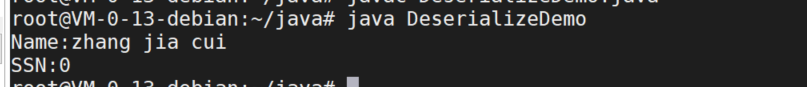
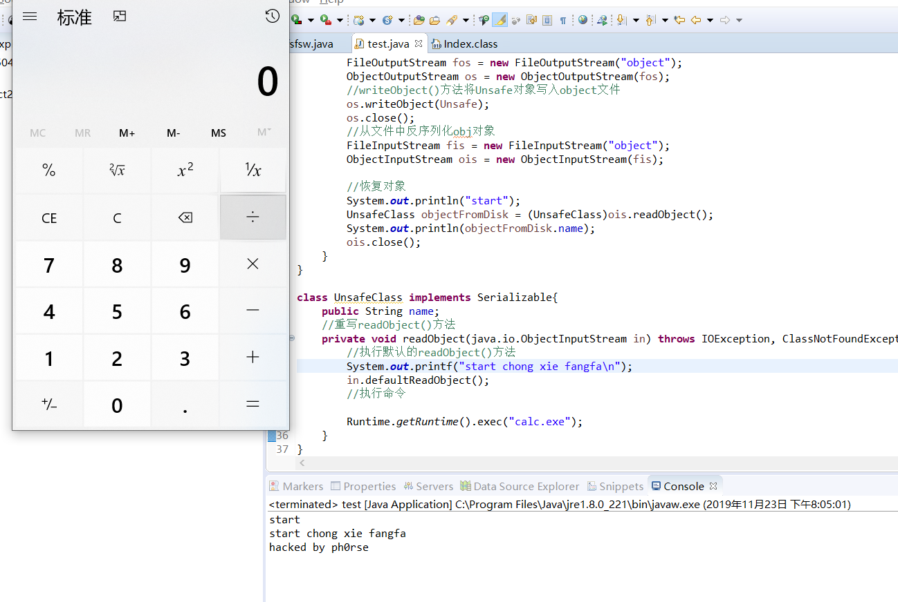

## 一.java 反序列化漏洞

### java 反序列化基础
java类ObjectInputStream 和 ObjectOutputStream 是高层的数据流，它们包含反序列化和序列化对象的方法，java.io.ObjectOutputStream是实现序列化的关键类，它可以将一个对象转换成二进制流，然后可以通过ObjectInputStream将二进制流还原成对象。

### 序列化条件
* 该类必须实现java.io.Serializable接口
* 该类的所有属性必须是可序列化的，如果有一个属性不是可序列化的，则该属性必须是短暂的。
  * 使用static的属性不能被序列化
  * 使用transient的属性是短暂的，是不序列化的


### final 关键字
* 当final修饰一个类时，表明这个类不能被继承
* 当final 修饰一个属性的时候，表明这个属性不能被修改
* 当final修饰一个方法，锁定方法，以防止任何继承类修改它的涵义


序列化一个对象，并将它发送到输出流
```java
public final void writeObject(Object x) throws IOException

```
反序列化一个对象的方法
```java
public final void readObject() throws IOException,ClassNotFoundException
```
### 序列化
测试类
```java
import java.io.*;


public class Employee implements Serializable
{
    public String name;
    public String address;
    public transient int SSN;
    public int number;
    public void mailCheck(){
	System.out.println("mail a check a"+this.name+this.address);
    }


}
```
序列化
```java
import java.io.*;


public class SerializeDemo
{
 	public static void main(String[] args)
	{
		Employee e = new Employee();
 	  	e.name="zhang jia cui";
		e.address="php   sfdsa";
		e.SSN=121321313;
  		e.number=101;
 	 try{
     //该类用来创建一个文件，如果该流在打开文件进行输出前，目标文件不存在，那么该流会创建该文件。
		FileOutputStream fileout = new FileOutputStream("/tmp/employee.ser");
		ObjectOutputStream out = new ObjectOutputStream(fileout);
    //序列化对象方法
    out.writeObject(e);
		out.close();
		fileout.close();
		System.out.printf("Seriablized is saved in /tmp/employee.ser");
		}catch(IOException i)
		{
			i.printStackTrace();
		}		

	}

}
```
### 反序列化

```java
import java.io.*;


public class DeserializeDemo
{
	public static void main(String[] args)
	{
		Employee e = null;
		try{


			FileInputStream fileIn = new FileInputStream("/tmp/employee.ser");
			ObjectInputStream In = new ObjectInputStream(fileIn);
			e = (Employee)In.readObject();
			In.close();
			fileIn.close();


		}catch(IOException i)
		{
			i.printStackTrace();
		}catch(ClassNotFoundException c)
		{
			System.out.println("Employee class not found");
			return ;
		}
		System.out.println("Name:"+e.name);
		System.out.println("SSN:"+e.SSN);
	}


}


```
反序列化成功

### java反序列漏洞形成原因
序列化和反序列化本身并不存在问题。但当输入的反序列化的数据可被用户控制，那么攻击者即可通过构造恶意输入，让反序列化产生非预期的对象，在此过程中执行构造的任意代码。

如下代码会弹一个计算机

```java
package whaotg;
import java.io.*;
public class test{
    public static void main(String args[]) throws Exception{

        UnsafeClass Unsafe = new UnsafeClass();
        Unsafe.name = "hacked by ph0rse";

        FileOutputStream fos = new FileOutputStream("object");
        ObjectOutputStream os = new ObjectOutputStream(fos);
        //writeObject()方法将Unsafe对象写入object文件
        os.writeObject(Unsafe);
        os.close();
        //从文件中反序列化obj对象
        FileInputStream fis = new FileInputStream("object");
        ObjectInputStream ois = new ObjectInputStream(fis);

        //恢复对象
        System.out.println("start");
        UnsafeClass objectFromDisk = (UnsafeClass)ois.readObject();
        System.out.println(objectFromDisk.name);
        ois.close();
    }
}

class UnsafeClass implements Serializable{
    public String name;
    //重写readObject()方法
    private void readObject(java.io.ObjectInputStream in) throws IOException, ClassNotFoundException{
        //执行默认的readObject()方法
        System.out.printf("start chong xie fangfa");
        in.defaultReadObject();
        //执行命令

        Runtime.getRuntime().exec("calc.exe");
    }
}

```
漏洞效果


漏洞发生在反序列化过程，MyObject类实现了Serializable接口，并重写了readObject()函数，当目标对象已经重写了readObject方法，则调用目标对象readObject方法，如果readObject能进行更多操作，就有可能照成代码执行
