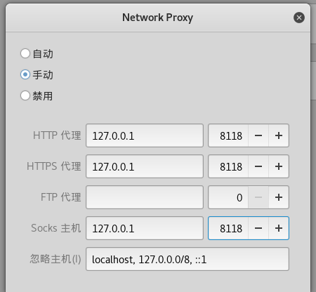

# ss+tor+本地网关 实现代理

## 1. 网关配置(ubuntu)

##### 内网网卡
* host-only模式
* 静态ip
* ip配置如下
      vim  /etc/network/interface
  内容如下
  ```
  auto ens38
  iface ens38 inet static
  address 192.168.12.8
  netmask 255.255.255.0
  ```


##### 外网网卡
* nat模式
* 动态静态都可以(保证与路由器在同一个段)

## 2.实现流量转发
* 开启转发功能
```
echo 1 > /proc/sys/net/ipv4/ipforward
```
或者通过
         vi /etc/sysctl.conf
         将net.ipv4.ip_forward=0更改为net.ipv4.ip_forward=1
         sysctl -p
* iptables 命令实现转发
```
iptables -t nat -A POSTROUTING -o eth0 -j MASQUERADE
```

iptables 命令解析
* -t : 指定表，默认为filter表
* -A ：表示在对应的链中"追加规则"，-A为append之意。在末尾
* -j ：指明当"匹配条件"被满足时，所对应的动作。

* POSTROUTING是源地址转换（SNAT），要把你内部网络上受防火墙保护的ip地址转换成你本地的公网地址才能让它们上网。
* PREROUTING是目的地址转换（DNAT），要把别人的公网IP换成你们内部的IP，才让访问到你们内部受防火墙保护的服务器。
* MASQUERADE他的作用是，从服务器的网卡上，自动获取当前ip地址来做NAT
MASQUERADE举例
* -o ：匹配报文是通过哪块网卡流出
假如当前系统用的是ADSL动态拨号方式，那么每次拨号，出口ip192.168.5.3都会改变，而且改变的幅度很大，不一定是192.168.5.3到192.168.5.5范围内的地址，这个时候如果按照现在的方式来配置iptables就会出现问题了，因为每次拨号后，服务器地址都会变化，而iptables规则内的ip是不会随着自动变化的，每次地址变化后都必须手工修改一次iptables，把规则里边的固定ip改成新的ip，这样是非常不好用的。
[还有外网到内部的转发](https://blog.csdn.net/subfate/article/details/52659446)

## 3.客户端配置(kail)
* host-only模式
* ip配置
  * 静态Ip(网关为网关内网ip)
  ```
    auto eth0
    iface eth0 inet static
    address 192.168.12.9
    netmask 255.255.255.0
    gateway 192.168.12.8
  ```
* 重启网卡
* 配置dns
  vim /etc/resolv.conf
  nameserver 8.8.8.8
  * 测试
          curl www.baidu.com

## 4.配置shadowsocks+tor
* 网关上配置
* 配置shadowsocks
  * 安装shadowsocks(python3 也可以)
         pip  install  shadowsocks
  * 添加配置文件ss.json

  ```
    {
      "server":"ip",
      "server_port":port,
      "local_address":"127.0.0.1",
      "local_port":Port,
      "password":"",
      "timeout":300,
      "method":"rc4-md5"

    }
  ```
  * 启动
          sslocal -c ss.json

  * 如果启动报错，检测配置文件，还有就是修改如下文件cleanup 修改为reset(2处)，然后重新启动

        vim /usr/local/lib/python2.7/dist-packages/shadowsocks/crypto/openssl.py
  * 为了方便开机重启，我们配置shadowsocks为一个服务[服务配置说明](https://www.ruanyifeng.com/blog/2016/03/systemd-tutorial-part-two.html)
```
#vim /lib/systemd/system/sslocal.service
[Unit]
Description=sslocal service
After=network.target syslog.target
Wants=network.target
[Service]
Type=simple
#启动服务的命令
ExecStart=/usr/local/bin/sslocal  -c  /root/ss.json
[Install]
WantedBy=graphical.target    
```
  * 执行如下命令
        systemctl daemon-reload
        systemctl start sslocal.service
* 配置tor

  *  下载tor
            apt-get insall tor  
  * 修改配置文件
    ```
      vim /etc/tor/torrc
      #添加如下配置
      SOCKSPort 0.0.0.0:9050
      SOCKSPolicy accept *
      SOCKS5Proxy 192.168.12.8:1080

    ```
    * 启动tor
          systemctl start tor
          systemctl enable tor

* 浏览器配置代理为9050，然后访问google,成功

## 客户端配置全局代理上网(kail)


* 下载privoxy.service
          apt-get install  privoxy
* 修改配置(在5.2添加如下)
          forward-socks5t  / 192.168.12.8:9050 .
          forward  localhost/ .
  * 这样修改是把所有流量都转发到192.168.12.8 9050端口上

* 启动privoxy

* 配置全局代理
在kail上配置


因为privoxy监听的是8118端口，所以设置为8118
## 设置tor 出口节点
  *  vim /etc/tor/torrc
              ExitNodes {CZ},{US} StrictNodes 1
  * [国家代码](http://davidstein.cz/2018/06/13/tor-setup-entry-and-exit-nodes-solved/)

