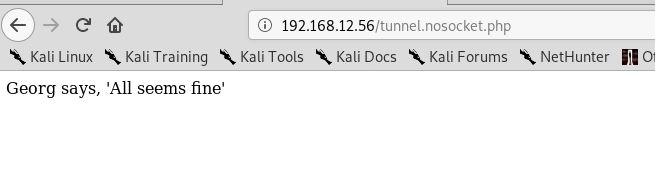

### 隧道技术在渗透测试中的应用
##### 场景
如果我们获取了公网服务器的权限，但该服务器开启了防火墙，只开放了80端口，如果我们要继续探测内网，可以通过reGeorg 结合proxchains 代理实现（http隧道）
##### 实验环境
* 攻击机：kail  192.168.12.9
* 目标机器：网卡1：192.168.0.1   网卡二  192.168.12.56
* 目标机器的网卡二攻击机器可以访问

我们尝试探测 192.168.0.1 网段的内容
* 1. 我们上传tunnel.nosocket.php到目标机器，访问，出现如下表示没的问题

* kail中
python reGeorgSocksProxy.py -p 9999 -u http://192.168.12.56/tunnel.nosocket.php
